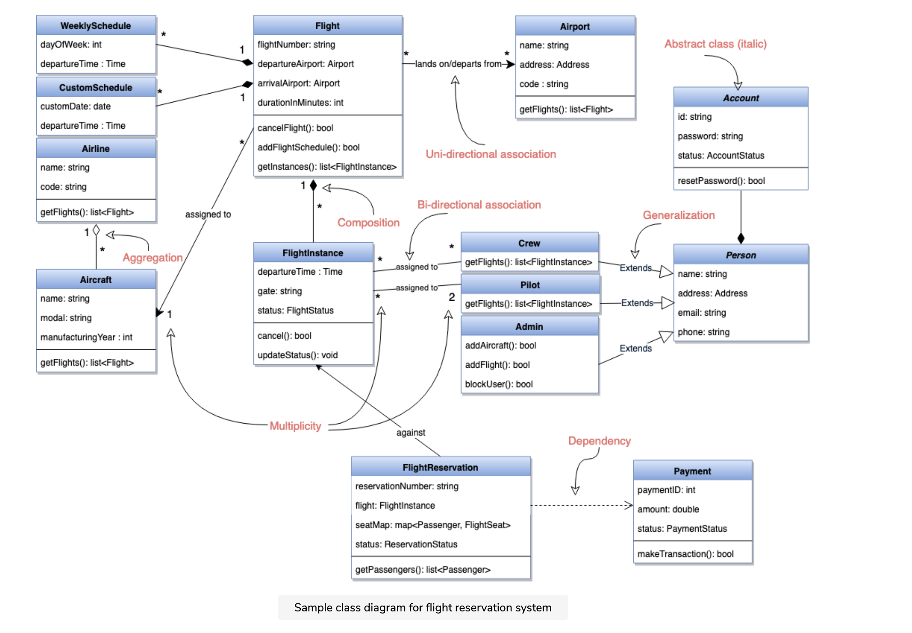
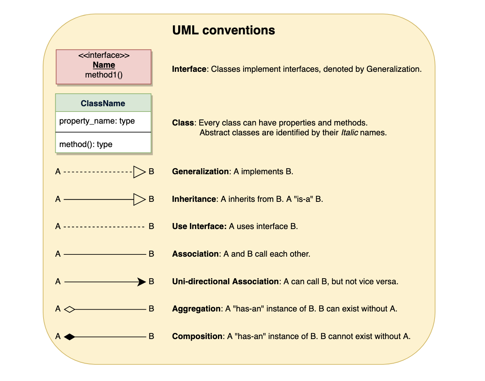

These are the different types of relationships between classes:

Association: If two classes in a model need to communicate with each other, there must be a link between them. This link can be represented by an association. Associations can be represented in a class diagram by a line between these classes with an arrow indicating the navigation direction.

    By default, associations are always assumed to be bi-directional; this means that both classes are aware of each other and their relationship. In the diagram below, the association between Pilot and FlightInstance is bi-directional, as both classes know each other.
    By contrast, in a uni-directional association, two classes are related - but only one class knows that the relationship exists. In the below example, only Flight class knows about Aircraft; hence it is a uni-directional association

Multiplicity Multiplicity indicates how many instances of a class participate in the relationship. It is a constraint that specifies the range of permitted cardinalities between two classes. For example, in the diagram below, one FlightInstance will have two Pilots, while a Pilot can have many FlightInstances. A ranged multiplicity can be expressed as “0…*” which means “zero to many" or as “2…4” which means “two to four”.

We can indicate the multiplicity of an association by adding multiplicity adornments to the line denoting the association. The below diagram, demonstrates that a FlightInstance has exactly two Pilots but a Pilot can have many FlightInstances.

Aggregation: Aggregation is a special type of association used to model a “whole to its parts” relationship. In a basic aggregation relationship, the lifecycle of a PART class is independent of the WHOLE class’s lifecycle. In other words, aggregation implies a relationship where the child can exist independently of the parent. In the above diagram, Aircraft can exist without Airline.

Composition: The composition aggregation relationship is just another form of the aggregation relationship, but the child class’s instance lifecycle is dependent on the parent class’s instance lifecycle. In other words, Composition implies a relationship where the child cannot exist independent of the parent. In the above example, WeeklySchedule is composed in Flight which means when Flight lifecycle ends, WeeklySchedule automatically gets destroyed.

Generalization: Generalization is the mechanism for combining similar classes of objects into a single, more general class. Generalization identifies commonalities among a set of entities. In the above diagram, Crew, Pilot, and Admin, all are Person.

Dependency: A dependency relationship is a relationship in which one class, the client, uses or depends on another class, the supplier. In the above diagram, FlightReservation depends on Payment.

Abstract class: An abstract class is identified by specifying its name in italics. In the above diagram, both Person and Account classes are abstract classes.

