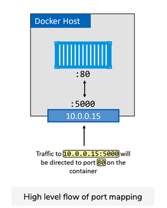

So far, we’ve said that containers on bridge networks can only communicate with other containers on the same network. However, you can get around this using port mappings.


# What are port mappings? #

Port mappings let you map a container to a port on the Docker host. Any traffic hitting the Docker host on the configured port will be directed to the container.



In the diagram, the application running in the container is operating on port 80. This is mapped to port 5000 on the host’s 10.0.0.15 interface. The end result is all traffic hitting the host on 10.0.0.15:5000 being redirected to the container on port 80.


## Example

Let’s walk through an example of mapping port 80 on a container running a web server, to port 5000 on the Docker host. The example will use NGINX on Linux. If you’re following along on Windows, you’ll need to substitute nginx with a Windows-based web server image such as mcr.microsoft.com/windows/servercore/iis:nanoserver.

1. Run a new web server container and map port 80 on the container to port 5000 on the Docker host.

``` shell
docker container run -d --name web --network localnet --publish 5000:80 nginx
```

2. Verifying the port mapping.

``` shell
docker port web
80/tcp -> 0.0.0.0:5000
```

This shows that port 80 in the container is mapped to port 5000 on all interfaces on the Docker host.

3. Test the configuration by pointing a web browser to port 5000 on the Docker host. To complete this step, you’ll need to know the IP or DNS name of your Docker host (in this lesson you can simply press the Run button of the playground below). If you’re using Docker Desktop on Mac or Windows, you’ll be able to use localhost:5000 or 127.0.0.1:5000.


Mapping ports like this works, but it’s clunky and doesn’t scale. For example, only a single container can bind to any port on the host. This means no other containers on that host will be able to bind to port 5000. This is one of the reasons that single-host bridge networks are only useful for local development and very small applications.

## Multi-host overlay networks

We’ve got an entire chapter dedicated to multi-host overlay networks. So we’ll keep this section short.

Overlay networks are multi-host. They allow a single network to span multiple hosts so that containers on different hosts can communicate directly. They’re ideal for container-to-container communication, including container-only applications, and they scale well.

Docker provides a native driver for overlay networks. This makes creating them as simple as adding the -d overlay flag to the docker network create command.

