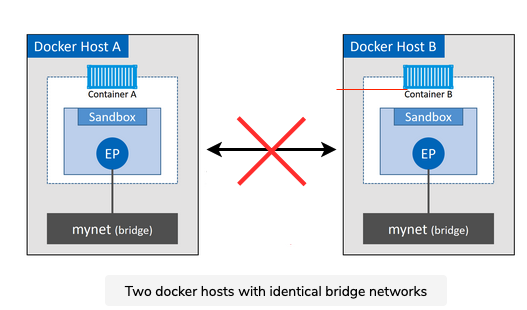
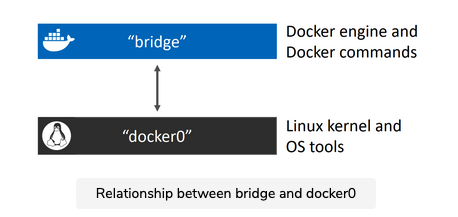
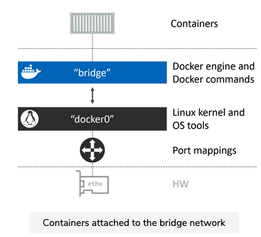
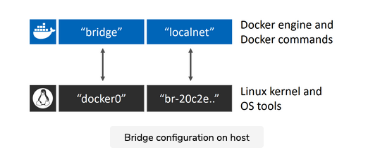
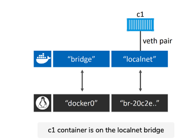

# What is a single-host bridge? 

The simplest type of Docker network is the single-host bridge network.

The name tells us two things:

- Single-host tells us it only exists on a single Docker host and can only connect containers that are on the same host.
- Bridge tells us that it’s an implementation of an 802.1d bridge (layer 2 switch).


Docker on Linux creates single-host bridge networks with the built-in bridge driver, whereas Docker on Windows creates them using the built-in nat driver. For all intents and purposes, they work the same.

# Example

The figure below shows two Docker hosts with identical local bridge networks called “mynet”. Even though the networks are identical, they are independent isolated networks. This means the containers in the picture cannot communicate directly because they are on different networks.




Every Docker host gets a default single-host bridege network. On Linux it's called "bridge", and on Windows, it's called "nat" (yes, those are the same names as the drivers used to create them). By default , this is the network that all new containers will be connected to unless you override it on the command line with the --network flag.


## Docker network ls

``` shell
# Linux
$ docker network ls
NETWORK ID        NAME        DRIVER        SCOPE
333e184cd343      bridge      bridge        local

# Windows
> docker network ls
NETWORK ID        NAME        DRIVER        SCOPE
095d4090fa32      nat         nat           local
```

## docker network inspect

The docker network inspect command is a treasure trove of great information. I highly recommend reading through its output if you're interested in low-level detail.

``` shell

FVFF87EFQ6LR :: ~ » docker network inspect bridge
[
    {
        "Name": "bridge",
        "Id": "5dd11744db0ab84d36c25391dcf3f06dd955071dd80b358329fd5e5aeca34cd8",
        "Created": "2021-07-28T05:41:39.526772918Z",
        "Scope": "local",
        "Driver": "bridge",
        "EnableIPv6": false,
        "IPAM": {
            "Driver": "default",
            "Options": null,
            "Config": [
                {
                    "Subnet": "172.17.0.0/16",
                    "Gateway": "172.17.0.1"
                }
            ]
        },
        "Internal": false,
        "Attachable": false,
        "Ingress": false,
        "ConfigFrom": {
            "Network": ""
        },
        "ConfigOnly": false,
        "Containers": {},
        "Options": {
            "com.docker.network.bridge.default_bridge": "true",
            "com.docker.network.bridge.enable_icc": "true",
            "com.docker.network.bridge.enable_ip_masquerade": "true",
            "com.docker.network.bridge.host_binding_ipv4": "0.0.0.0",
            "com.docker.network.bridge.name": "docker0",
            "com.docker.network.driver.mtu": "1500"
        },
        "Labels": {}
    }
]
```


Docker networks built with the bridge driver on Linux hosts are based on the battle-hardened linux bridge technology that has existed in the Linux kernel for nearly 20 years. This means they're high performance and extremely stable. It also means you can inspect them using standard Linux utilities. For example.

``` shell
$ ip link show docker0
3: docker0: <BROADCAST,MULTICAST,UP,LOWER_UP> mtu 1500 qdisc...
    link/ether 02:42:af:f9:eb:4f brd ff:ff:ff:ff:ff:ff
```

# Default bridge network

The default "bridge" network, on all Linux-based Docker hosts, maps to an underlying Linux bridge in the kernel called "docker0". We can see this from the output of docker network inspect.

``` shell
FVFF87EFQ6LR :: ~ » docker network inspect bridge | grep bridge.name
            "com.docker.network.bridge.name": "docker0",
```

The relationship between Docker’s default “bridge” network and the “docker0” bridge in the Linux kernel is shown below.



The figure below extends the diagram by adding containers at the top that plug into the “bridge” network. The “bridge” network maps to the “docker0” Linux bridge in the host’s kernel, which can be mapped back to an Ethernet interface on the host via port mappings.




## Create a new network

Let's use the docker network create command to create a new single-host bridge network called localnet.


``` shell
docker network create -d bridge localnet
```


The new network is created and will appear in the output of any future docker network ls commands. If you are using Linux, you will also have a new Linux bridge created in the kernel.

Let's use the Linux brctl tool to look at the Linux bridges currently on the system. You may have to manually install the brctl binary using apt-get install bridge bridge-utils, or the equivalent for your Linux distro.

``` shell
$ brctl show
bridge name       bridge id             STP enabled    interfaces
docker0           8000.0242aff9eb4f     no
br-20c2e8ae4bbb   8000.02429636237c     no
```

### macos
this is not working

``` shell
networksetup -listallhardwareports   
```

The output shows two bridges. The first line is the “docker0” bridge that we already know about. This relates to the default “bridge” network in Docker. The second bridge (br-20c2e8ae4bbb) relates to the new localnet Docker bridge network. Neither of them has a spanning tree enabled, and neither have any devices connected (interfaces column).

At this point, the bridge configuration on the host looks like the figure below.



Let's create a new container and attach it to the new localnet bridge network.

``` shell
docker container run -d --name c1 --network localnet alpine sleep 1d
```

This container will now be on the localnet network. You can confirm this with a docker network inspect.

``` shell
docker network inspect localnet --format '{{json .Containers}}'
```


The output shows that the new "c1" container is on the localnet bridge/nat network.

If you run the Linux brctl show command again, you'll see c1's interface attached to the br-20c2e8ae4bbb bridge.




## Adding a new container

If we add another new container to the same network, it should be able to ping the “c1” container by name. This is because all new containers are automatically registered with the embedded Docker DNS service, enabling them to resolve the names of all other containers on the same network.

> Beware: The default bridge network on Linux does not support name resolution via the Docker DNS service. All other user-defined bridge networks do. The following demo will work because the container is on the user-defined localnet network.

1. Create a new interactive container called “c2” and put it on the same localnet network as “c1”.

``` shell
# Linux
$ docker container run -it --name c2 --network localnet alpine sh

# Windows
> docker container run -it --name c2 --network localnet mcr.microsoft.com/powershell:nanoserver
```

2. From within the “c2” container, ping the “c1” container by name.
``` shell
FVFF87EFQ6LR :: ~ » docker container run -it --name c2 --network localnet alpine sh
/ # ping c1
PING c1 (172.23.0.2): 56 data bytes
64 bytes from 172.23.0.2: seq=0 ttl=64 time=0.124 ms
64 bytes from 172.23.0.2: seq=1 ttl=64 time=0.065 ms
64 bytes from 172.23.0.2: seq=2 ttl=64 time=0.093 ms
```

It works! This is because the "c2" container is running a local DNS resolver that forwards requests to an internal Docker DNS server.

This DNS server maintains mappings for all containers started with the --name or --net-alias flag.


Try running some network-related commands while you're still logged on to the container. It's a great way of learning more about how Docker container networking works. The following snippet shows the ipconfig command ran from inside the "c2" Windows conatiner previously created.

You can Ctrl+P+Q out of the container and run another docker network inspect localnet command to match the IP addresses.

``` shell
/ # ifconfig
eth0      Link encap:Ethernet  HWaddr 02:42:AC:17:00:03  
          inet addr:172.23.0.3  Bcast:172.23.255.255  Mask:255.255.0.0
          UP BROADCAST RUNNING MULTICAST  MTU:1500  Metric:1
          RX packets:15 errors:0 dropped:0 overruns:0 frame:0
          TX packets:8 errors:0 dropped:0 overruns:0 carrier:0
          collisions:0 txqueuelen:0 
          RX bytes:1418 (1.3 KiB)  TX bytes:672 (672.0 B)

lo        Link encap:Local Loopback  
          inet addr:127.0.0.1  Mask:255.0.0.0
          UP LOOPBACK RUNNING  MTU:65536  Metric:1
          RX packets:4 errors:0 dropped:0 overruns:0 frame:0
          TX packets:4 errors:0 dropped:0 overruns:0 carrier:0
          collisions:0 txqueuelen:1000 
          RX bytes:210 (210.0 B)  TX bytes:210 (210.0 B)

/ # %                                                                                                                                FVFF87EFQ6LR :: ~ » docker network inspect localnet
[
    {
        "Name": "localnet",
        "Id": "1fc25390bdee6e48821404305ebe97ee756639f4cb17b9f3525c4097214a59f5",
        "Created": "2021-08-08T05:46:20.884678717Z",
        "Scope": "local",
        "Driver": "bridge",
        "EnableIPv6": false,
        "IPAM": {
            "Driver": "default",
            "Options": {},
            "Config": [
                {
                    "Subnet": "172.23.0.0/16",
                    "Gateway": "172.23.0.1"
                }
            ]
        },
        "Internal": false,
        "Attachable": false,
        "Ingress": false,
        "ConfigFrom": {
            "Network": ""
        },
        "ConfigOnly": false,
        "Containers": {
            "77cb621dc1ebbaf2c4bddbf5c1bfd226b527af88bea3c205decd11fddb60fd01": {
                "Name": "c2",
                "EndpointID": "c24632f7ce1bb19998d725765cb4f90b05c15d1ae256e563fe706a25d6ea1c14",
                "MacAddress": "02:42:ac:17:00:03",
                "IPv4Address": "172.23.0.3/16",
                "IPv6Address": ""
            },
            "e0e67b2ef828640db0dd307f90dd2b1851bba86f5284af815ab7d38b3240d40f": {
                "Name": "c1",
                "EndpointID": "3f587e7efbe9140bbad8fd61717e125f1443d9af7263f32aa49b38675d9acedd",
                "MacAddress": "02:42:ac:17:00:02",
                "IPv4Address": "172.23.0.2/16",
                "IPv6Address": ""
            }
        },
        "Options": {},
        "Labels": {}
    }
]
FVFF87EFQ6LR :: ~ » 

```


When Swarm starts a container on an overlay network, it automatically extends that network to the node the container is running on. This means that the uber-net network is now visible on node2.

``` shell

[root@10-13-175-37 ~]# docker network ls
NETWORK ID     NAME              DRIVER    SCOPE
be58ad34c4f2   bridge            bridge    local
433dbce26e5a   docker_gwbridge   bridge    local
ccb8a6d5ae5e   host              host      local
weymwxn6r4g5   ingress           overlay   swarm
266bd93eac1c   none              null      local
2eovlux4gauc   uber-net          overlay   swarm

```

## What about standalone containers? 


Standalone containers that are not part of a swarm service cannot attach to overlay networks unless they have the attachable=true property. The following command can be used to create an attachable overlay network that standalone containers can also attach to.

``` shell
docker network create -d overlay --attachable uber-net
```