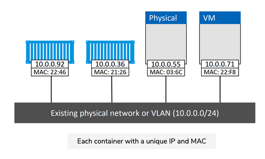
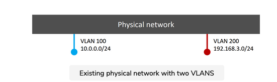
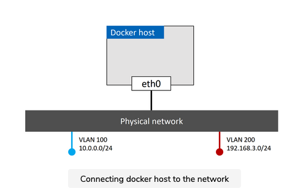
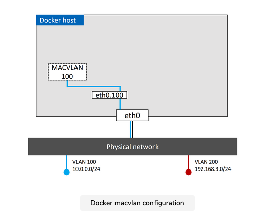
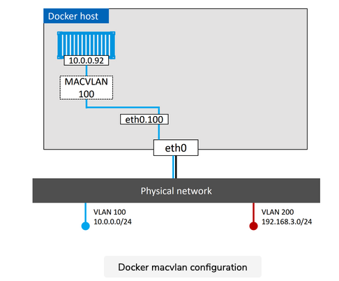
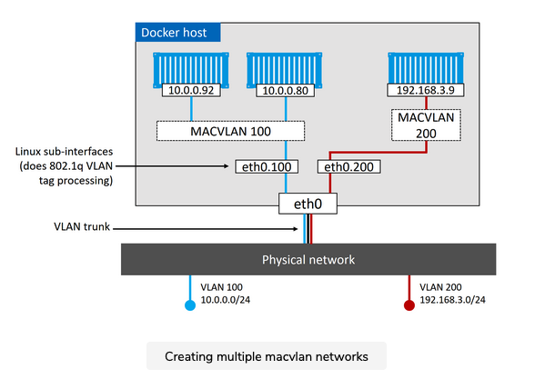

The ability to connect containerized apps to external systems and physical networks is vital. A common example is a partially containerized app; the containerized parts need a way to communicate with the non-containerized parts still running on existing physical networks and VLANs.

# MACVLAN

The built-in MACVLAN driver (transparent on Windows) was created with this in mind. It makes containers first-class citizens on the existing physical networks by giving each one its own MAC address and IP addresses. We show this in the figure below.




On the positive side, MACVLAN’s performance is good as it doesn’t require port mappings or additional bridges; you connect the container interface through to the host’s interface (or a sub-interface). However, on the negative side, it requires the host NIC to be in promiscuous mode, which isn’t always allowed on corporate networks and public cloud platforms. So MACVLAN is great for your corporate data center networks (assuming your network team can accommodate promiscuous mode), but it might not work on the public cloud.


## Example

Let’s dig a bit deeper with the help of some pictures and a hypothetical example.

Assume we have an existing physical network with two VLANS:


- VLAN 100: 10.0.0.0/24
- VLAN 200: 192.168.3.0/24



Next, we add a Docker host and connect it to the network.


### Docker macvlan configuration

We then have a requirement for a container running on that host to be plumbed into VLAN 100. To do this, we create a new Docker network with the macvlan driver. However, the macvlan driver needs us to tell it a few things about the network we’re going to associate it with. Things like:

- Subnet info
- Gateway
- Range of IP's it can assign to containers
- Which interface or subinterface on the host to use

The following command will create a new MACVLAN network called "macvlan100" that will connect containers to VLAN 100.


``` shell
docker network create -d macvlan \
  --subnet=10.0.0.0/24 \
  --ip-range=10.0.0.0/25 \
  --gateway=10.0.0.1 \
  -o parent=eth0.100 \
  macvlan100
```

> macos bigsur should use this command.
``` shell
docker network create -d macvlan \
  --subnet=192.168.191.0/24 \
  --ip-range=192.168.191.0/25 \
  --gateway=192.168.191.1 \
  -o parent=en0.10 \
  macvlan100
```

This will create the “macvlan100” network and the eth0.100 sub-interface. The config now looks like this.



MACVLAN uses standard Linux sub-interfaces, and you have to tag them with the ID of the VLAN they will connect to. In this example we’re connecting to VLAN 100, so we tag the sub-interface with .100 (etho.100).


### IP range

We also used the --ip-range flag to tell the MACVLAN network which subset of IP addresses it can assign to containers. It’s vital that this range of addresses be reserved for Docker and not in use by other nodes or DHCP servers, as there is no management plane feature to check for overlapping IP ranges.

## Deploying the network 

The macvlan100 network is ready for containers, so let’s deploy one with the following command.
``` shell
docker container run -d --name mactainer1 --network macvlan100 alpine sleep 1d

```

The config now looks like the figure below. But remember, the underlying network (VLAN 100) does not see any of the MACVLAN magic, it only sees the container with its MAC and IP addresses. And with that in mind, the “mactainer1” container will be able to ping and communicate with any other systems on VLAN 100. Pretty sweet!

> If you can’t get this to work, it might be because the host NIC is not in promiscuous mode. Remember that public cloud platforms don’t usually allow promiscuous mode.
Moreover, our platform doesn’t support promiscuous mode, so the commands in this lesson wouldn’t work in the playground.




##  Creating multiple MACVLAN networks
At this point, we’ve got a MACVLAN network and used it to connect a new container to an existing VLAN. However, it doesn’t stop there. The Docker MACVLAN driver is built on top of the tried-and-tested Linux kernel driver with the same name. As such, it supports VLAN trunking. This means we can create multiple MACVLAN networks and connect containers on the same Docker host to them as shown below.




## terminology

promiscuous
In a network, promiscuous mode allows a network device to intercept and read each network packet that arrives in its entirety. This mode of operation is sometimes given to a network snoop server that captures and saves all packets for analysis (for example, for monitoring network usage).


## Note

due to the Linux ( which is running on the public cloud) and Macos bigsur . I did not run this example successfully 
https://docs.docker.com/docker-for-mac/networking/


https://goyalankit.com/blog/promiscuous-mode-detection

https://docs.docker.com/network/macvlan/

https://docs.docker.com/network/network-tutorial-macvlan/