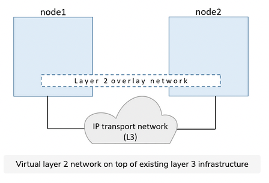
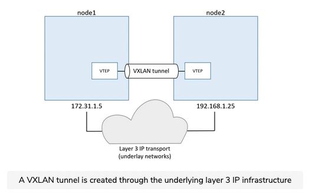
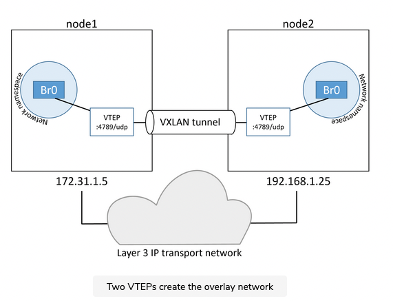
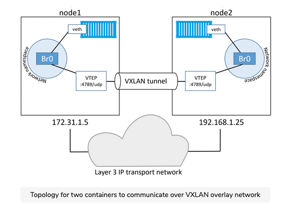

# Overview

Overlay networks are at the beating heart of many cloud-native microservices apps. In this chapter, we’ll cover the fundamentals of native Docker overlay networking.

Docker overlay networking on Windows has feature parity with Linux. This means the examples we’ll use in this chapter will all work on Linux and Windows.

Let’s do some networking magic.

In the real world, it’s vital that containers can communicate with each other reliably and securely, even when they’re on different hosts that are on different networks. This is where overlay networking comes into play. It allows you to create a flat, secure, layer-2 network, spanning multiple hosts. Containers connect to this and can communicate directly.

Docker offers native overlay networking that is simple to configure and secure by default.

Behind the scenes, it’s built on top of libnetwork and drivers. libnetwork is the canonical implementation of the Container Network Model (CNM) and drivers are pluggable components that implement different networking technologies and topologies. Docker offers native drivers, including the overlay driver.

In March 2015, Docker, Inc. acquired a container networking startup called Socket Plane. Two of the reasons behind the acquisition were to bring real networking to Docker and to make container networking simple enough that even developers could do it.

They over-achieved on both.

However, hiding behind the simple networking commands are a lot of moving parts, the kind of stuff you need to understand before doing production deployments and attempting to troubleshoot issues.

The rest of this chapter will be broken into two parts:

- Part 1: We’ll build and test a Docker overlay network
- Part 2: We’ll explain the magic that makes it work

``` shell
docker swarm join --token SWMTKN-1-3qlo1dhmx3xhrr7taunivuqt3eolcrvqpij0xt8pythm6l4vga-d7bitgjhw244rli2iafimiwn2 10.13.63.31:2377 \ --advertise-addr 10.13.175.37 --listen-addr 10.0.0.4:2377
```

``` shell
ubuntu@10-13-63-31:~/playground$ sudo docker network ls
NETWORK ID     NAME              DRIVER    SCOPE
7bf98cd2c6d1   bridge            bridge    local
fe80bd7c1653   docker_gwbridge   bridge    local
66b34be06017   host              host      local
weymwxn6r4g5   ingress           overlay   swarm
e4460e42886b   localnet          bridge    local
a471252da61d   none              null      local
2eovlux4gauc   uber-net          overlay   swarm
```

If you run the docker network ls command on node2, you’ll notice that it can’t see the uber-net network. This is because new overlay networks are only extended to worker nodes when they are tasked with running a container on it. This lazy approach to extended overlay networks improves network scalability by reducing the amount of network gossip.


# The Theory of Docker Overlay Networking

Now that you've seen how easy it is to build and use a secure overlay network, let's find out how it's all put together behind the scenes.

## VXLAN primer

First and foremost, Docker overlay networking uses VXLAN tunnels to create virtual Layer 2 overlay networks. So, before we go any further, let's do a quick VXLAN primer.

At the highest level, VXLANs let you create a virtual Layer 2 network on top of an existing Layer 3 infrastructure. That's a lot of techno-jargon that means you can create a simple network that hide horrifically complex networks beneath. The example we used earlier created a new 10.0.0.0/24 Layer 2 network on top of a Layer 3 IP network comprising two Layer 2 networks; 172.31.1.0/24 and 192.168.1.0/24.




## Encapsulation by VXLAN

The beauty of VXLAN is that it's an encapsulation technology that existing routes and network infrastructure just see as regular IP/UDP packets and handle without issue.


To create a virtual Layer 2 overlay network, a VXLAN tunnel is created through the underlying Layer 3 IP infrastructure. You might hear the term *underlay network* used to refer to the underlaying Layer 3 infrastructure -- the networks that the Docker hosts are connected to.

Each end of the VXLAN tunnel is terminated by a VXLAN Tunnel Endpoint (VTEP). It's this VTEP that performs the encapsulation/de-encapsulation and other magic required to make all of this work.



## Examine our two-container example

In the example from earlier, you had two hosts connected via an IP network. Each host ran a single container, and you created a single VXLAN overlay network for the containers.

### Sandbox


To accomplish this, a new sandbox (network namespace) was created on each host. As mentioned in the previous chapter, a sandbox is like a container, but instead of running an application, it runs an isolated network stack; one that's sandboxed from the network stack of the host itself.

### Virtual switch

A virtual switch (a.k.a virtual bridge) called Br0 is created inside the sandbox. A VTEP is also created with one end plumped into the Br0 virtual switch, and the other end plumped into the host network stack(VTEP). The end in the host network stack gets an IP address on the underlay network the host is connected to , and is bound to a UDP socket on port 4789. The two VTEPs on each host create the overlay via a VXLAN tunnel as seen in the figure below.



At this point, the VXLAN overlay is created and ready for use.

Each container then gets its own virtual Ethernet(veth adapter) that is also plumbed into the local Br0 virtual switch. The technology now looks like  the figure below, and it should be getting easier to see how the two containers can communicate over the VXLAN overlay network despite their hosts being on two separate networks.

