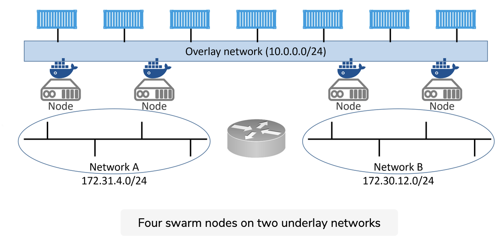

## 1.

based on the  Raft consensus algorithm


## Manager high availability #
On the topic of HA, the following two best practices apply:

    Deploy an odd number of managers.
    Don’t deploy too many managers (3 or 5 is recommended)


## Auto-lock


``` shell
[root@10-13-66-101 ~]# docker swarm update --autolock=true
Swarm updated.
To unlock a swarm manager after it restarts, run the `docker swarm unlock`
command and provide the following key:

    SWMKEY-1-u62ffvh2Px/KnBUvFr6BbjrH6E3u9dqQDOF1sEjHGDM

Please remember to store this key in a password manager, since without it you
will not be able to restart the manager.
```

## unlocking

``` shell
[root@10-13-66-101 ~]# service docker restart
Redirecting to /bin/systemctl restart docker.service
[root@10-13-66-101 ~]# docker node ls
Error response from daemon: Swarm is encrypted and needs to be unlocked before it can be used. Please use "docker swarm unlock" to unlock it.
[root@10-13-66-101 ~]# 

[root@10-13-66-101 ~]# docker swarm unlock
Please enter unlock key: 
[root@10-13-66-101 ~]# docker node ls
ID                            HOSTNAME       STATUS    AVAILABILITY   MANAGER STATUS   ENGINE VERSION
wf895sz0yry30o7qc70l88v04     10-13-63-31    Ready     Active         Leader           20.10.8
kirvqb5ndj4lfw02prx3vecu3     10-13-63-89    Ready     Active                          20.10.8
036c251pszb9mkwgo5sbqeivx *   10-13-66-101   Ready     Active         Reachable        20.10.8
3et1c2pnhu6po2qo0idj3m3mq     10-13-97-183   Ready     Active         Reachable        20.10.8
i9pvvywify0m0kwkrk34ebkue     10-13-148-61   Ready     Active                          20.10.8
lnq8pld2h5fji9hx7s8kswt7m     10-13-175-37   Ready     Active                          20.10.8

```


## creating services

You can create services in one of two ways:

    1. Imperatively on the command line with docker service create
    2. Declaratively with a stack file

Let’s review the command and output.


``` shell
docker service create --name web-fe -p 8080:8080 --replicas 5 nigelpoulton/ddd-web:2.0
```
We used docker service create to tell Docker we are declaring a new service, and we used the --name flag to name it web-fe. We told Docker to map port 8080 on every node in the swarm to 8080 inside of each service replica. Next, we used the --replicas flag to tell Docker there should always be 5 replicas of this service. Finally, we told Docker which image to use for the replicas — it’s important to understand that all service replicas use the same image and config!

After we hit Return, the command was sent to a manager node, and the manager acting as leader instantiated 5 replicas across the swarm — remember that swarm managers also act as workers. Each worker or manager that received a work task pulled the image and started a container listening on port 8080. The swarm leader also ensured a copy of the service’s desired state was stored on the cluster and replicated to every manager.

## Service monitoring

But this isn’t the end. All services are constantly monitored by the swarm — the swarm runs a background reconciliation loop that constantly compares the observed state of the service with the desired state. If the two states match, the world is a happy place and no further action is needed. If they don’t match, the swarm takes actions to bring the observed state into line with the desired state.

As an example, if a worker hosting one of the 5 web-fe replicas fails, the observed state of the web-fe service will drop from 5 replicas to 4. This will no longer match the desired state of 5, so the swarm will start a new web-fe replica to bring the observed state back in line with desired state. This behavior is a key tenet of cloud-native applications and allows the service to self-heal in the event of node failures and the likes.


## Inspect service 


``` shell
docker service inspect --pretty web-fe
```


## Replicated, vs global services 

The default replication mode of a service is replicated. This deploys a desired number of replicas and distributes them as evenly as possible across the cluster.

The other mode is global, which runs a single replica on every node in the swarm.

To deploy a global service you need to pass the --mode global flag to the docker service create command.


## Scaling a service


``` shell
docker service scale web-fe=10
```


## Removing a service 

``` shell
docker service rm web-fe
``` 


# pusing updates to an application

## creating an overlay network

``` shell
docker network create -d overlay uber-net
```

This creates a new overlay network called “uber-net” that we’ll use for the service we’re about to create. An overlay network creates a new layer 2 network that we can place containers on, and all containers on it will be able to communicate. This works even if all of the swarm nodes are on different underlying networks. Basically, the overlay network creates a new layer 2 container network on top of potentially multiple different underlying networks.

The figure below shows four swarm nodes on two underlay networks connected by a layer 3 router. The overlay network spans all 4 swarm nodes creating a single flat layer 2 network for containers to use.





# Port mapping

Passing the service the -p 8080:8080 flag will ensure that a swarm-wide mapping is created that maps all traffic, coming into any node in the swarm on port 8080, through to port 8080 inside of any service replica.

This mode of publishing a port on every node in the swarm — even nodes not running service replicas — is called ingress mode and is the default. The alternative mode is host mode which only publishes the service on swarm nodes running replicas. Publishing a service in host mode requires the long-form syntax and looks as follows:

``` shell
docker service create --name uber-svc --network uber-net \
   --publish published=8080,target=8080,mode=host --replicas 12 nigelpoulton/ddd-web:1.0

```

## Swarm service application

Open a web browser and point it to the IP address of any of the nodes in the swarm on port 8080 to see the service running.


As you can see, it’s a simple application for Docker learners. Feel free to point your web browser to other nodes in the swarm. You’ll be able to reach the web service from any node because the -p 8080:8080 flag creates an ingress mode mapping on every swarm node. This is true even on nodes that are not running a replica for the service — every node gets a mapping and can therefore redirect your request to a node that is running the service.


## Updating the application 

Let’s now assume that your company wants to change some text on the website. A new container image has been created for the new text and has been added to the same Docker Hub repository, but this one is tagged as 2.0 instead of 1.0.

``` shell
docker service update --image nigelpoulton/ddd-web:2.0 \
      --update-parallelism 2 --update-delay 20s uber-svc
```


### not good

``` shell
error from daemon in stream: Error grabbing logs: rpc error: code = Unknown desc = warning: incomplete log stream. some logs could not be retrieved for the following reasons: node kirvqb5ndj4lfw02prx3vecu3 is not available
```

