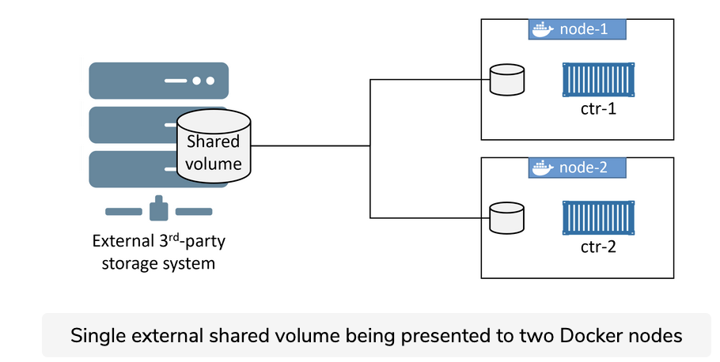

Sharing Storage across Cluster Nodes

Integrating external storage systems with Docker makes it possible to share volumes between cluster nodes. These external systems can be cloud storage services or enterprise storage systems in your on-premises data centers.


## Single storage example


As an example, a single storage LUN or NFS share can be presented to multiple Docker hosts, allowing it to be used by containers and service replicas no matter which Docker host they’re running on. The figure below shows a single external shared volume being presented to two Docker nodes. These Docker nodes can then make the shared volume available to either, or both containers.




Building a setup like this requires a lot of things. You need access to specialized storage systems and knowledge of how it works and presents storage. You also need to know how your applications read and write data to the shared storage. Finally, you need a volumes driver plugin that works with the external storage system.

## Find plugins from Docker Hub

Docker Hub is the best place to find volume plugins. Login to Docker Hub, select the view to show plugins instead of containers, and filter results to only show Volume plugins. Once you’ve located the appropriate plugin for your storage system, you create any configuration files it might need and install it with docker plugin install.

Once the plugin is registered, you can create new volumes from the storage system using docker volume create with the -d flag.


## Pure Storage Docker volume plugin

The following example installs the Pure Storage Docker volume plugin. This plugin provides access to storage volumes on either a Pure Storage FlashArray or FlashBlade storage system. Plugins only work with the correct external storage systems.

1. The Pure Storage plugin requires a configuration file called pure.json in the Docker host’s /etc/pure-docker-plugin/ directory. This file contains the information required for the plugin to locate the external storage system, authenticate, and access resources.
2. Install the plugin and grant the required permissions.


``` shell

sudo docker plugin install purestorage/docker-plugin:3.8 --alias pure --grant-all-permissions

```