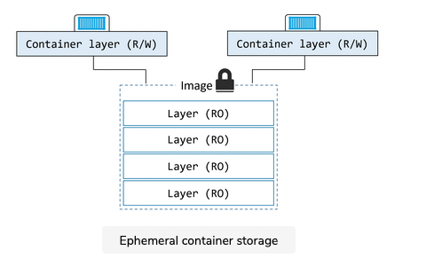
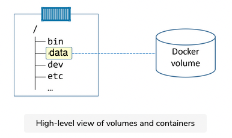
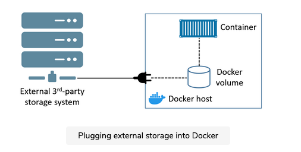

Stateful applications that persist data are becoming more and more important in the world of cloud-native and microservices applications. Docker is an important infrastructure technology in this space, so we’ll turn our attention in this chapter to investigating how Docker handles applications that write persistent data.


There are two main categories of data; persistent and non-persistent.

Persistent is the data you need to keep. Things like; customer records, financial data, research results, audit logs, and even some types of application log data. Non-persistent is the data you don’t need to keep. Both are important, and Docker has solutions for both.


## Non-persistent data

To deal with non-persistent data, every Docker container gets its own non-persistent storage. This is automatically created for every container and is tightly coupled to the lifecycle of the container. As a result, deleting the container will delete the storage and any data on it.

## Persistent data

To deal with persistent data, a container needs to store it in a volume. Volumes are separate objects that have their lifecycles decoupled from containers. This means you can create and manage volumes independently, and they’re not tied to the lifecycle of any container. Net result, you can delete a container that’s using a volume, and the volume won’t be deleted.


## The Deep Dive

There’s a popular opinion that containers aren’t good for stateful applications that persist data. This was true a few years ago. However, things are changing, and technologies now exist that make containers a viable choice for many stateful applications.

Am I saying containers are the best solution for all stateful applications? No. However, we’re about to see some of the ways that containers deal with persistent and non-persistent data, and you may find it hard to see many differences with virtual machines.

We’ll start out with non-persistent data.


# Containers and Non-Persistent Data

Containers are designed to be immutable. This is just a buzzword that means read-only — it’s a best practice not to change the configuration of a container after it’s deployed. If something breaks or you need to change something, you should create a new container with the fixes/updates and deploy it in place of the old container. You shouldn’t log into a running container and make configuration changes!


## The need for read-write filesystems #


However, many applications require a read-write filesystem in order to simply run — they won’t even run on a read-only filesystem. This means it’s not as simple as making containers entirely read-only. Every Docker container is created by adding a thin read-write layer on top of the read-only image it’s based on. The figure below shows two running containers sharing a single read-only image.



## The writable container layer

The writable container layer exists in the filesystem of the Docker host, and you’ll hear it called various names. These include local storage, ephemeral storage, and graphdriver storage. It’s typically located on the Docker host in these locations:

- Linux Docker hosts: /var/lib/docker/<storage-driver>/...
- Windows Docker hosts: C:\ProgramData\Docker\windowsfilter\...

This thin writable layer is an integral part of a container and enables all read/write operations. If you, or an application, update files or add new files, they’ll be written to this layer. However, it’s tightly coupled to the container’s lifecycle — it gets created when the container is created and it gets deleted when the container is deleted. The fact that it’s deleted along with a container means that it’s not an option for important data that you need to keep (persist).

If your containers don’t create persistent data, this thin writable layer of local storage will be fine and you’re good to go. However, if your containers need to persist data, you need to read the next lesson.


## Storage drivers #

This writable layer of local storage is managed on every Docker host by a storage driver (not to be confused with a volume driver). If you’re running Docker in production on Linux, you’ll need to make sure you match the right storage driver with the Linux distribution on your Docker host. Use the following list as a guide:


- Red Hat Enterprise Linux: Use the overlay2 driver with modern versions of RHEL running Docker 17.06 or higher. Use the devicemapper driver with older versions. This applies to Oracle Linux and other Red Hat related upstream and downstream distros.

- Ubuntu: Use the overlay2 or aufs drivers. If you’re using a Linux 4.x kernel or higher you should go with overlay2.

- SUSE Linux Enterprise Server: Use the btrfs storage driver.

- Windows: Windows only has one driver and it is configured by default.


# Containers and Persistent data


## Overview

Volumes are the recommended way to persist data in containers. There are three major reasons for this:
- Volumes are independent objects that are not tied to the lifecycle of a container.
- Volumes can be mapped to specialized external storage systems.
- Volumes enable multiple containers on different Docker hosts to access and share the same data.


At a high level, you create a volume, then you create a container and mount the volume into it. The volume is mounted into a directory in the container’s filesystem, and anything written to that directory is stored in the volume. If you delete the container, the volume and its data will still exist.

The figure below shows a Docker volume existing outside of the container as a separate object. It is mounted into the container’s filesystem at /data, and any data written to the /data directory will be stored on the volume and will exist after the container is deleted.




In the figure above, the /data directory is a Docker volume that can either be mapped to an external storage system or a directory on the Docker host. Either way, its lifecycle is decoupled from the container. All other directories in the container use the thin writable container layer in the local storage area on the Docker host.


The arrow from the volume to the /data directory is shown as a dotted line to represent the decoupled relationship between volumes and containers.


## Managing Docker volumes

Volumes are first-class citizens in Docker. Among other things, this means they are their own object in the API and have their own docker volume sub-command.


### Creating volumes

Use the following command to create a new volume called myvol.

``` shell
$ docker volume create myvol
myvol
```

By default, Docker creates new volumes with the built-in local driver. As the name suggests, volumes created with the local driver are only available to containers on the same node as the volume. You can use the -d flag to specify a different driver.

Third-party volume drivers are available as plugins. These provide Docker with seamless access to external storage systems such as cloud storage services and on-premises storage systems including SAN or NAS. This is shown below.



### Inspecting volumes


Now that the volume is created, you can see it with the docker volume ls command and inspect it with the docker volume inspect command.

``` shell

ubuntu@10-13-63-31:~$ sudo docker volume ls
DRIVER    VOLUME NAME
local     4e1577befb723aef4fcd3ad495a2e979ad1a4ff56271901bb2be2ec31a5fc830
local     056336ffad09bf3a65939f7c3e74fa3989b519850f6d1015a9a3eaa68f0cf647
local     counter-app_counter-vol
local     myvol
ubuntu@10-13-63-31:~$ sudo docker volume 
create   inspect  ls       prune    rm       
ubuntu@10-13-63-31:~$ sudo docker volume inspect myvol
[
    {
        "CreatedAt": "2021-08-12T21:01:29+08:00",
        "Driver": "local",
        "Labels": {},
        "Mountpoint": "/var/lib/docker/volumes/myvol/_data",
        "Name": "myvol",
        "Options": {},
        "Scope": "local"
    }
]

```


Notice that the Driver and Scope are both local. This means the volume was created with the local driver and is only available to containers on this Docker host. The Mountpoint property tells us where in the Docker host’s filesystem the volume exists.

All volumes created with the local driver get their own directory under /var/lib/docker/volumes on Linux, and C:\ProgramData\Docker\volumes on Windows. This means you can see them in your Docker host’s filesystem. You can even access them directly from your Docker host, although this is not normally recommended. We showed an example of this in the chapter on Docker Compose — we copied a file directly into a volume’s directory on the Docker host and the file immediately appeared in the volume inside the container.

Now that the volume is created, it can be used by one or more containers. We’ll see usage examples in a minute.


### Deleting volumes #


There are two ways to delete a Docker volume:

- docker volume prune
- docker volume rm

docker volume prune will delete all volumes that are not mounted into a container or service replica, so use with caution! docker volume rm lets you specify exactly which volumes you want to delete. Neither command will delete a volume that is in use by a container or service replica.

As the myvol volume is not in use, delete it with the prune command.


## Alternate methods to deploy volumes

At this point, you know all of the commands to create, list, inspect, and delete Docker volumes. However, it’s also possible to deploy volumes via Dockerfiles using the VOLUME instruction. The format is VOLUME <container-mount-point>. Interestingly, you cannot specify a directory on the host when defining a volume in a Dockerfile. This is because host directories are different depending on what OS your Docker host is running – it could break your builds if you specified a directory on a Docker host that doesn’t exist. As a result, defining a volume in a Dockerfile requires you to specify host directories at deploy-time.

