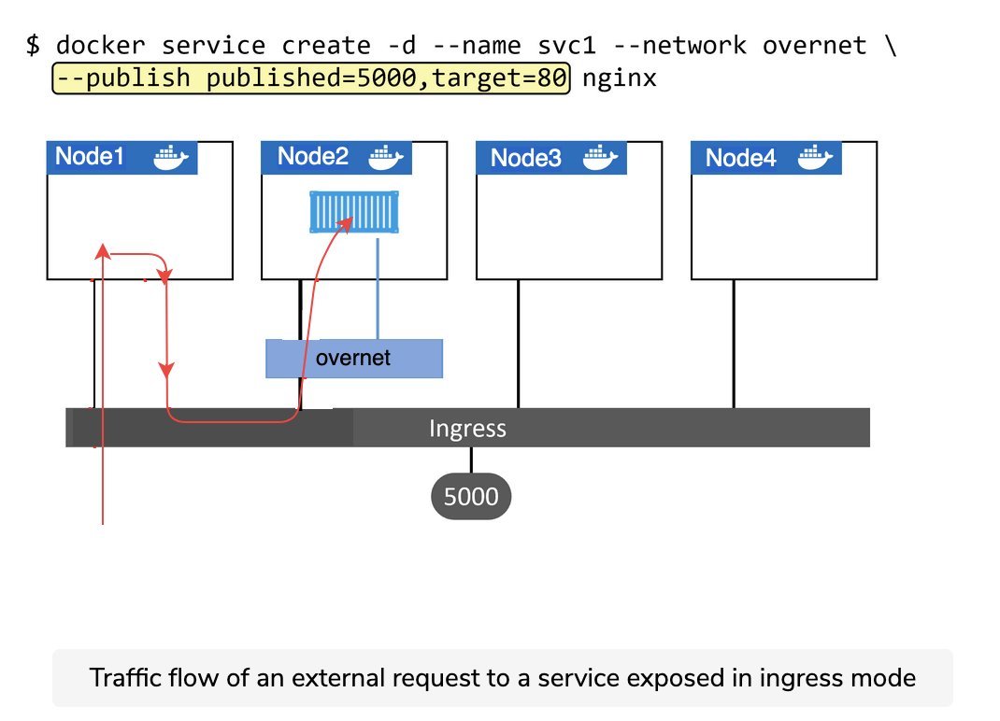

## Ingress mode vs. host mode

Swarm supports two publishing modes that make services accessible outside of the cluster:

- Ingress mode (default)
- Host mode

Services published via ingress mode can be accessed from any node in the Swarm; even nodes not running a service replica. Services published via host mode can only be accessed by hitting nodes running service replicas. The figure below shows the difference between the two modes.


## Host mode

Ingress mode is the default. This means any time you publish a service with -p or --publish it will default to ingress mode. To publish a service in host mode you need to use the long format of the --publish flag and add mode=host. Let’s see an example using host mode.


``` shell
docker service create -d --name svc1 --publish published=5000,target=80,mode=host nginx
```

### docker service create

A few notes about the command. docker service create lets you publish a service using either a long-form syntax or short-form syntax. The short-form looks like this: -p 5000:80 and we’ve seen it a few times already. However, you cannot publish a service in host mode using short form.

The long-form looks like this: --publish published=5000,target=80,mode=host. It’s a comma-separated list with no whitespace after each comma. The options work as follows:

- published=5000 makes the service available externally via port 5000
- target=80 makes sure that external requests to the published port get mapped back to port 80 on the service replicas
- mode=host makes sure that external requests will only reach the service if they come in via nodes running a service replica.


## Ingress mode

Ingress mode is what you’ll normally use.

Behind the scenes, ingress mode uses a layer 4 routing mesh called the Service Mesh or the Swarm Mode Service Mesh. The figure below shows the basic traffic flow of an external request to a service exposed in ingress mode.


Let’s quickly walk through the diagram.

1. The command at the top deploys a new Swarm service called “svc1”. It’s attaching the service to the overnet network and publishing it on port 5000.
2. Publishing a Swarm service like this (--publish published=5000,target=80) will publish it on port 5000 on the ingress network. As all nodes in a Swarm are attached to the ingress network, this means the port is published swarm-wide.
3. Logic is implemented on the cluster ensuring that any traffic hitting the ingress network, via any node, on port 5000 will be routed to the “svc1” service on port 80.
4. At this point, a single replica for the “svc1” service is deployed, and the cluster has a mapping rule that says “all traffic hitting the ingress network on port 5000 needs routing to a node running a replica for the ‘svc1’ service”.
5. The red line shows traffic hitting node1 on port 5000 and being routed to the service replica running on node2 via the ingress network.


Docker networking has its own docker network sub-command. The main commands include:

- docker network ls lists all networks on the local Docker host.

- docker network create creates new Docker networks. By default, it creates them with the nat driver on Windows and the bridge driver on Linux. You can specify the driver (type of network) with the -d flag. docker network create -d overlay overnet will create a new overlay network called overnet with the native Docker overlay driver.

- docker network inspect provides detailed configuration information about a Docker network.

- docker network prune deletes all unused networks on a Docker host.

- docker network rm deletes specific networks on a Docker host.

