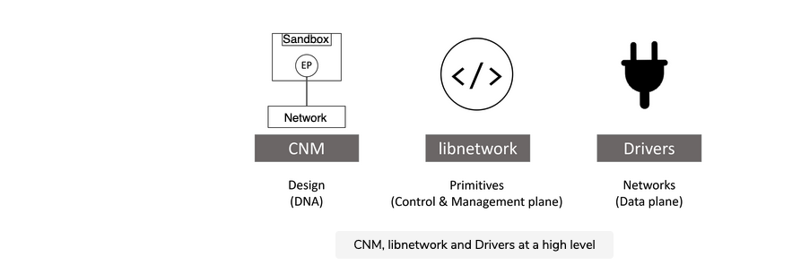
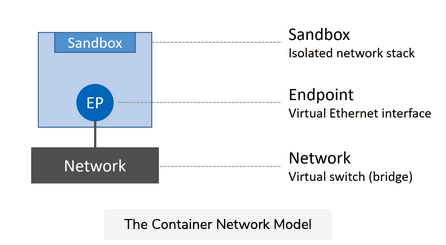
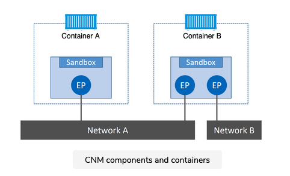
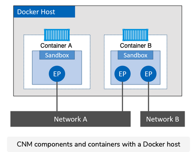
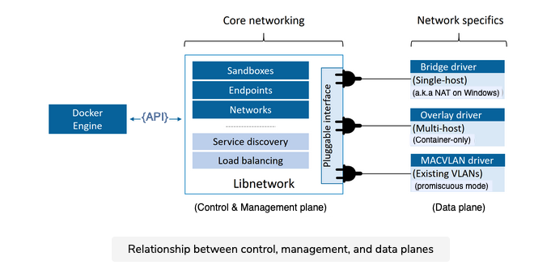

# Docker Networking

In this chapter, we'll look at the fundamentals of Docker networking. Things like the Container Network Model (CNM) and libnetwork. We'll also get our hands dirty building some networks.

## The TLDR

Docker runs applications inside of containers, and applications need to communicate over lots of different networks. This means Docker needs strong networking capabilities.

Fortunately, Docker has solutions for container-to-container networks, as well as connecting to existing networks and VLANs. The latter is important for containerized apps that interact with functions and services on external systems such as VM's and physical servers.

Docker networking is based on an open-source pluggable architecture called the Container Network Model (CNM). libnetwork is Docker's real-world implementation of the CNM, and it provides all of Docker's core networking capabilities. Drivers plug into libnetwork to provide specific network topologies.

To create a smooth out of the box experience, Docker ships with a set of native drivers that deal with the most common networking requirements. These include single-host bridge networks, multi-host overlays, and options for plugging into existing VLANs. Ecosystem partners can extend things further by providing their own drivers.

Last but not least, libnetwork provides a native service discovery and basic container load balancing solution.

That's this big picture. Let's get into the details.

## The Container Network Model (CNM)

Everything starts with a design.

The design guide for Docker networking is the CNM. It outlines the fundamental building blocks of a Docker network, and you can read the full spec [here](https://github.com/moby/libnetwork/blob/master/docs/design.md).

I recommend reading the entire spec, but at a high level, it defines three major building blocks:
- Sandboxes
- Endpoints
- Networks

A **sandbox** is an isolated network stack. It includes; Ethernet interfaces, ports, routing tables, and DNS config.

**Endpoints** are virtual network interfaces (E.g. veth). Like normal network interfaces, they're responsible for making connections. In the case of the CNM, it's the job of the endpoint to connect a sandbox to a network.

**Networks** are a software implementation of a switch(802.1d bridge). As such, they group together and isolate a collection of endpoints that need to communicate.

The figure below shows the three components and how they connect.

## Containers

The atomic unit of scheduling in a Docker environment is the container, and as the name suggests, the Container Network Model is all about providing networking to containers. The figure shows how CNM components relate to containers; sandboxes are placed inside of containers to provide network connectivity.

Container A has a single interface(endpoint) and is connected to Network A. Container B has two interfaces (Endpoints) and is connected to Network A and Network B. The two containers will be able to communicate because they are both connected to Network A. However, the two endpoints in Container B cannot communicate with each other without the assistance of a layer 3 router.

## Endpoints

It's also important to understand that endpoints behave like regular network adapters, meaning they can only be connected to a single network. Therefore, if a container needs to multiple networks, it will need multiple endpoints.

The figure below extends the diagram again, this time adding a Docker host. Although Container A and Container B are running on the same host, their network stacks are completely isolated at the OS-level via the sandboxes.

## Libnetwork

The CNM is the design doc, and libnetwork is the canonical implementation. It's open-source, written in Go, cross-platform(Linux and Windows), and used by Docker.

In the early days of Docker, all the networking code existed inside the daemon. This was a nightmare -- the daemon became bloated, and it didn't follow the Unix principle of building modular tools that can work on their own, but also be easily composed into other projects. As a result, it all got ripped out and refactored into an external library called libnetwork based on the principles of the CNM. Nowadays, all of the core Docker networking code lives in libnetwork.

As you'd expect, it implements all three of the component defined in the CNM. It also implements native service discovery, ingress-based container and load balancing, and the network control plane and management plane functionality.

## Drivers

If libnetwork implements the control plane and management plane functions, then drivers implement the data plane. For example, connectivity and isolation is all handled by drivers. So is the actual creation of networks. The relationship is shown in the figure below.

Docker ships with several built-in drivers, known as native drivers or local drivers. On Linux, they include bridge, overlay, and macvlan. On Windows, they include nat, overlay, transparent, and l2bridge. We'll see how to use some of them later in the chapter.

3rd-parties can also write Docker network drivers known as remote drivers or plugins. Weave Net is a popular example and can be downloaded from Docker Hub.

Each driver is in charge of the actual creation and management of all resources on the networks it is responsible for. For example, an overlay network called “prod-fe-cuda” will be owned and managed by the overlay driver. This means the overlay driver will be invoked for the creation, management, and deletion of all resources on that network.

In order to meet the demands of complex highly-fluid environments, libnetwork allows multiple network drivers to be active at the same time. This means your Docker environment can sport a wide range of heterogeneous networks.

