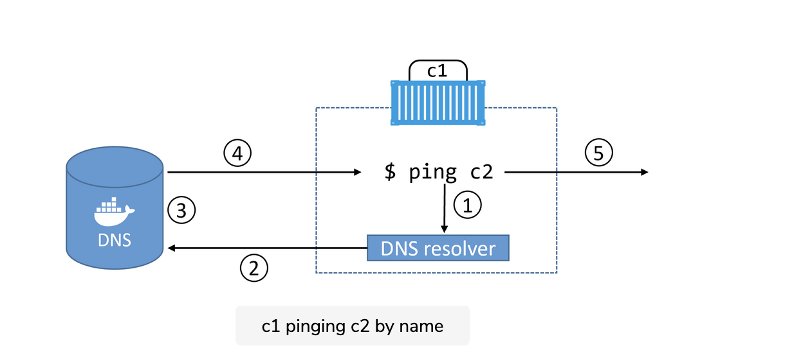

Let’s step through the process.

- Step 1: The ping c2 command invokes the local DNS resolver to resolve the name “c2” to an IP address. All Docker containers have a local DNS resolver.

- Step 2: If the local resolver doesn’t have an IP address for “c2” in its local cache, it initiates a recursive query to the Docker DNS server. The local resolver is pre-configured to know how to reach the Docker DNS server.

- Step 3: The Docker DNS server holds name-to-IP mappings for all containers created with the --name or --net-alias flags. This means it knows the IP address of container “c2”.

- Step 4: The DNS server returns the IP address of “c2” to the local resolver in “c1”. It does this because the two containers are on the same network; if they were on different networks this would not work.

- Step 5: The ping command issues the ICMP echo request packets to the IP address of “c2”.

Every Swarm service and standalone container started with the --name flag will register its name and IP with the Docker DNS service. This means all containers and service replicas can use the Docker DNS service to find each other.

However, service discovery is network-scoped. This means that name resolution only works for containers and Services on the same network. If two containers are on different networks, they will not be able to resolve each other.

 


## Customized DNS option

One last point on service discovery and name resolution; it’s possible to configure Swarm services and standalone containers with customized DNS options. For example, the --dns flag lets you specify a list of custom DNS servers to use in case the embedded Docker DNS server cannot resolve a query. This is common when querying the names of services outside of Docker. You can also use the --dns-search flag to add custom search domains for queries against unqualified names (i.e. when the query is not a fully qualified domain name).

``` shell
docker container run -it --name c1 --dns=8.8.8.8 --dns-search=nigelpoulton.com alpine sh
```