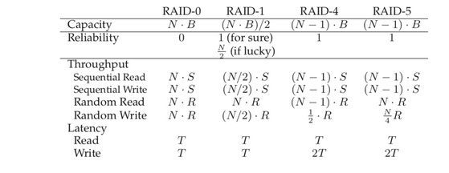

RAID Comparison: A Summary

We now summarize our simplified comparison of RAID levels in the table below.

Note that we have omitted a number of details to simplify our analysis. For example, when writing in a mirrored system, the average seek time is a little higher than when writing to just a single disk, because the seek time is the max of two seeks (one on each disk). Thus, random write performance to two disks will generally be a little less than random write performance of a single disk. Also, when updating the parity disk in RAID-4/5, the first read of the old parity will likely cause a full seek and rotation, but the second write of the parity will only result in rotation.

However, the comparison in the table above does capture the essential differences and is useful for understanding tradeoffs across RAID levels. For the latency analysis, we simply use TTT to represent the time that a request to a single disk would take.

## Conclusion

To conclude, if you strictly want performance and do not care about reliability, striping is obviously best. If, however, you want random I/O performance and reliability, mirroring is the best; the cost you pay is in lost capacity. If capacity and reliability are your main goals, then RAID-5 is the winner; the cost you pay is in small-write performance. Finally, if you are always doing sequential I/O and want to maximize capacity, RAID-5 also makes the most sense.

We have discussed RAID in this chapter. RAID transforms a number of independent disks into a large, more capacious, and more reliable single entity. Importantly, it does so transparently, and thus hardware and software above is relatively oblivious to the change.

There are many possible RAID levels to choose from, and the exact RAID level to use depends heavily on what is important to the end-user. For example, mirrored RAID is simple, reliable, and generally provides good performance but at a high capacity cost. RAID-5, in contrast, is reliable and better from a capacity standpoint, but performs quite poorly when there are small writes in the workload. Picking a RAID and setting its parameters (chunk size, number of disks, etc.) properly for a particular workload is challenging, and remains more of an art than a science.

