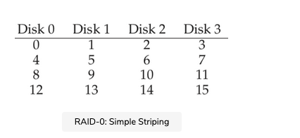
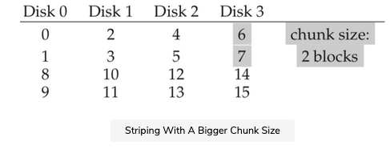

When we use a disk, we sometimes wish it to be faster; I/O operations are slow and thus can be the bottleneck for the entire system. When we use a disk, we sometimes wish it to be larger; more and more data is being put online and thus our disks are getting fuller and fuller. When we use a disk, we sometimes wish for it to be more reliable. When a disk fails, if our data isn’t backed up, all that valuable data is gone.

In this chapter, we introduce the Redundant Array of Inexpensive Disks better known as RAID, a technique to use multiple disks in concert to build a faster, bigger, and more reliable disk system. The term was introduced in the late 1980s by a group of researchers at U.C. Berkeley, led by Professors David Patterson and Randy Katz and then student Garth Gibson. It was around this time that many different researchers simultaneously arrived upon the basic idea of using multiple disks to build a better storage system.


Externally, a RAID looks like a disk: a group of blocks one can read or write. Internally, the RAID is a complex beast, consisting of multiple disks, memory (both volatile and non-), and one or more processors to manage the system. A hardware RAID is very much like a computer system, specialized for the task of managing a group of disks.


## Advantage of RAID

RAIDs offer a number of advantages over a single disk. One advantage is performance. Using multiple disks in parallel can greatly speed up I/O times. Another benefit is capacity. Large data sets demand large disks. Finally, RAIDs can improve reliability; spreading data across multiple disks (without RAID techniques) makes the data vulnerable to the loss of a single disk; with some form of redundancy, RAIDs can tolerate the loss of a disk and keep operating as if nothing were wrong.

TIP: TRANSPARENCY ENABLES DEPLOYMENT

When considering how to add new functionality to a system, one should always consider whether such functionality can be added transparently, in a way that demands no changes to the rest of the system. Requiring a complete rewrite of the existing software (or radical hardware changes) lessens the chance of impact of an idea. RAID is a perfect example, and certainly, its transparency contributed to its success; administrators could install a SCSI-based RAID storage array instead of a SCSI disk, and the rest of the system (host computer, OS, etc.) did not have to change one bit to start using it. By solving this problem of deployment, RAID was made more successful from day one.

Amazingly, RAIDs provide these advantages transparently to systems that use them, i.e., a RAID just looks like a big disk to the host system. The beauty of transparency, of course, is that it enables one to simply replace a disk with a RAID and not change a single line of software; the operating system and client applications continue to operate without modification. In this manner, transparency greatly improves the deployability of RAID, enabling users and administrators to put a RAID to use without worries of software compatibility.

In this chapter, we discuss some of the important aspects of RAIDs. We begin with the interface, fault model, and then discuss how one can evaluate a RAID design along three important axes: capacity, reliability, and performance. We then discuss a number of other issues that are important to RAID design and implementation.


## Interface and RAID internals

To a file system above, a RAID looks like a big, (hopefully) fast, and (hopefully) reliable disk. Just as with a single disk, it presents itself as a linear array of blocks, each of which can be read or written by the file system (or another client).


When a file system issues a logical I/O request to the RAID, the RAID internally must calculate which disk (or disks) to access in order to complete the request, and then issue one or more physical I/Os to do so. The exact nature of these physical I/Os depends on the RAID level, as we will discuss in detail below. However, as a simple example, consider a RAID that keeps two copies of each block, each one on a separate disk. In this case, when writing to such a mirrored RAID system, the RAID will have to perform two physical I/Os for every one logical I/O it is issued.

A RAID system is often built as a separate hardware box, with a standard connection (e.g., SCSI, or SATA) to a host. Internally, however, RAIDs are fairly complex, consisting of:


- A microcontroller that runs firmware to direct the operation of the RAID.
- Volatile memory such as DRAM to buffer data blocks as they are read and written.
- In some cases, non-volatile memory to buffer writes safely and perhaps even specialized logic to perform parity calculations (useful in some RAID levels, as we will also see below).


At a high level, a RAID is very much a specialized computer system: it has a processor, memory, and disks. However, instead of running applications, it runs specialized software designed to operate the RAID.


## Fault Model

To understand RAID and compare different approaches, we must have a fault model in mind. RAIDs are designed to detect and recover from certain kinds of disk faults. Thus, knowing exactly which faults to expect is critical in arriving upon a working design.

The first fault model we will assume is quite simple and has been called the fail-stop fault model. In this model, a disk can be in exactly one of two states: working or failed. With a working disk, all blocks can be read or written. In contrast, when a disk has failed, we assume it is permanently lost.

One critical aspect of the fail-stop model is what it assumes about fault detection. Specifically, when a disk has failed, we assume that this is easily detected. For example, in a RAID array, we would assume that the RAID controller hardware (or software) can immediately observe when a disk has failed.

Thus, for now, we do not have to worry about more complex “silent” failures such as disk corruption. We also do not have to worry about a single block becoming inaccessible upon an otherwise working disk (sometimes called a latent sector error). We will consider these more complex (and unfortunately, more realistic) disk faults later.


## How to Evaluate a RAID


As we will soon see, there are a number of different approaches to building a RAID. Each of these approaches has different characteristics that are worth evaluating, in order to understand their strengths and weaknesses.

Specifically, we will evaluate each RAID design along the following three axes:

### Capacity

The first axis is capacity; given a set of NNN disks each with BBB blocks, how much useful capacity is available to clients of the RAID? Without redundancy, the answer is N.BN.BN.B. In contrast, if we have a system that keeps two copies of each block (called mirroring), we obtain a useful capacity of (N.B)/2(N.B)/2(N.B)/2. Different schemes (e.g., parity-based ones) tend to fall in between.

### Reliability#


The second axis of evaluation is reliability. How many disk faults can the given design tolerate? In alignment with our fault model, we assume only that an entire disk can fail. In later chapters (i.e., on data integrity), we’ll think about how to handle more complex failure modes.


## Performance#

Finally, the third axis is performance. Performance is somewhat challenging to evaluate because it depends heavily on the workload presented to the disk array. Thus, before evaluating performance, we will first present a set of typical workloads that one should consider.

We now consider three important RAID designs:

    RAID Level 0 (striping)
    RAID Level 1 (mirroring)
    RAID Levels 4/5 (parity-based redundancy).

The naming of each of these designs as a “level” stems from the pioneering work of Patterson, Gibson, and Katz at Berkeley.

## RAID Level 0: Striping

The first RAID level is actually not a RAID level at all, in that there is no redundancy. However, RAID level 0, or striping as it is better known, serves as an excellent upper-bound on performance and capacity and thus is worth understanding.

The simplest form of striping will stripe blocks across the disks of the system as follows (assume here a 4-disk array):



From the figure above, you get the basic idea: spread the blocks of the array across the disks in a round-robin fashion. This approach is designed to extract the most parallelism from the array when requests are made for contiguous chunks of the array (as in a large, sequential read, for example). We call the blocks in the same row a stripe; thus, blocks 0, 1, 2, and 3 are in the same stripe above.

In the example, we have made the simplifying assumption that only 1 block (each of say size 4KB) is placed on each disk before moving on to the next. However, this arrangement need not be the case. For example, we could arrange the blocks across disks as shown in the figure below:


In the example, we have made the simplifying assumption that only 1 block (each of say size 4KB) is placed on each disk before moving on to the next. However, this arrangement need not be the case. For example, we could arrange the blocks across disks as shown in the figure below:



In this example, we place two 4KB blocks on each disk before moving on to the next disk. Thus, the chunk size of this RAID array is 8KB, and a stripe thus consists of 4 chunks or 32KB of data.

ASIDE: THE RAID MAPPING PROBLEM

Before studying the capacity, reliability, and performance characteristics of the RAID, we first present an aside on what we call the mapping problem. This problem arises in all RAID arrays; simply put, given a logical block to read or write, how does the RAID know exactly which physical disk and offset to access?

For these simple RAID levels, we do not need much sophistication in order to correctly map logical blocks onto their physical locations. Take the first striping example above (chunk size = 1 block = 4KB). In this case, given a logical block address A, the RAID can easily compute the desired disk and offset with two simple equations:

For these simple RAID levels, we do not need much sophistication in order to correctly map logical blocks onto their physical locations. Take the first striping example above (chunk size = 1 block = 4KB). In this case, given a logical block address A, the RAID can easily compute the desired disk and offset with two simple equations:

``` shell
     Disk   = A % number_of_disks
     Offset = A / number_of_disks
```

Note that these are all integer operations (e.g., 4 / 3 = 1 not 1.33333…). Let’s see how these equations work for a simple example. Imagine in the first RAID above that a request arrives for block 14. Given that there are 4 disks, this would mean that the disk we are interested in is (14 % 4 = 2): disk 2. The exact block is calculated as (14 / 4 = 3): block 3. Thus, block 14 should be found on the fourth block (block 3, starting at 0) of the third disk (disk 2, starting at 0), which is exactly where it is.

You can think about how these equations would be modified to support different chunk sizes. Try it! It’s not too hard.


### Chunk sizes

Chunk size mostly affects the performance of the array. For example, a small chunk size implies that many files will get striped across many disks, thus increasing the parallelism of reads and writes to a single file. However, the positioning time to access blocks across multiple disks increases, because the positioning time for the entire request is determined by the maximum of the positioning times of the requests across all drives.

A big chunk size, on the other hand, reduces such intra-file parallelism, and thus relies on multiple concurrent requests to achieve high throughput. However, large chunk sizes reduce positioning time. If, for example, a single file fits within a chunk and thus is placed on a single disk, the positioning time incurred while accessing it will just be the positioning time of a single disk.

Thus, determining the “best” chunk size is hard to do, as it requires a great deal of knowledge about the workload presented to the disk system. For the rest of this discussion, we will assume that the array uses a chunk size of a single block (4KB). Most arrays use larger chunk sizes (e.g., 64 KB), but for the issues we discuss below, the exact chunk size does not matter; thus we use a single block for the sake of simplicity.


## Back to RAID-0 analysis

Let us now evaluate the capacity, reliability, and performance of striping. From the perspective of capacity, it is perfect: given NNN disks each of size BBB blocks, striping delivers N.BN.BN.B blocks of useful capacity. From the standpoint of reliability, striping is also perfect, but in a bad way: any disk failure will lead to data loss. Finally, performance is excellent: all disks are utilized, often in parallel, to service user I/O requests.


## Evaluating RAID performance#

In analyzing RAID performance, one can consider two different performance metrics. The first is a single-request latency. Understanding the latency of a single I/O request to a RAID is useful as it reveals how much parallelism can exist during a single logical I/O operation. The second is steady-state throughput of the RAID, i.e., the total bandwidth of many concurrent requests. Because RAIDs are often used in high-performance environments, the steady-state bandwidth is critical, and thus will be the main focus of our analyses.

To understand throughput in more detail, we need to put forth some workloads of interest. We will assume, for this discussion, that there are two types of workloads: sequential and random. With a sequential workload, we assume that requests to the array come in large contiguous chunks. For example, a request (or series of requests) that accesses 1 MB of data, starting at block xxx and ending at block (xxx+1 MB), would be deemed sequential. Sequential workloads are common in many environments (think of searching through a large file for a keyword), and thus are considered important.


For random workloads, we assume that each request is rather small, and that each request is to a different random location on disk. For example, a random stream of requests may first access 4KB at logical address 10, then at logical address 550,000, then at 20,100, and so forth. Some important workloads, such as transactional workloads on a database management system (DBMS), exhibit this type of access pattern, and thus it is considered an important workload.

Of course, real workloads are not so simple, and often have a mix of sequential and random-seeming components as well as behaviors in-between the two. For simplicity, we just consider these two possibilities.

As you can tell, sequential and random workloads will result in widely different performance characteristics from a disk. With sequential access, a disk operates in its most efficient mode, spending little time seeking and waiting for rotation and most of its time transferring data. With random access, just the opposite is true: most time is spent seeking and waiting for rotation and relatively little time is spent transferring data. To capture this difference in our analysis, we will assume that a disk can transfer data at SSS MB/s under a sequential workload, and RRR MB/s when under a random workload. In general, SSS is much greater than RRR (i.e., S>>RS >> RS>>R).

To make sure we understand this difference, let’s do a simple exercise. Specifically, let’s calculate S and R given the following disk characteristics. Assume a sequential transfer of size 10 MB on average, and a random transfer of 10 KB on average. Also, assume the following disk characteristics:

Average seek time =7= 7=7 ms

Average rotational delay =3= 3=3 ms

Transfer rate of disk =50= 50=50 MB/s

To compute S, we need to first figure out how time is spent in a typical 10 MB transfer. First, we spend 7 ms seeking, and then 3 ms rotating. Finally, transfer begins; 10 MB at a rate of 50 MB/s leads to 1/5th of a second, or 200 ms, spent in transfer. Thus, for each 10 MB request, we spend 210 ms completing the request. To compute SSS, we just need to divide:

S=AmountofDataTimetoaccess=10MB210ms=47.62MB/sS = \frac {AmountofData} {Timetoaccess} = \frac {10MB} {210ms} =47.62MB/s S=​Timetoaccess​​AmountofData​​=​210ms​​10MB​​=47.62MB/s

As we can see, because of the large time spent transferring data, SSS is very near the peak bandwidth of the disk (the seek and rotational costs have been amortized).

We can compute RRR similarly. Seek and rotation are the same; we then compute the time spent in transfer, which is 10 KB at a rate of 50 MB/s, or 0.195 ms.

R=AmountofDataTimetoaccess=10 KB10.195 ms=0.981 MB/sR = \frac {AmountofData} {Timetoaccess}= \frac {10\ KB}{10.195\ ms} =0.981\ MB/s R=​Timetoaccess​​AmountofData​​=​10.195 ms​​10 KB​​=0.981 MB/s

As we can see, RRR is less than 1 MB/s, and S/RS/RS/R is almost 50.

Let’s now evaluate the performance of striping. As we said above, it is generally good. From a latency perspective, for example, the latency of a single-block request should be just about identical to that of a single disk; after all, RAID-0 will simply redirect that request to one of its disks.

From the perspective of steady-state sequential throughput, we’d expect to get the full bandwidth of the system. Thus, throughput equals NNN (the number of disks) multiplied by SSS (the sequential bandwidth of a single disk). For a large number of random I/Os, we can again use all of the disks and thus obtain N.RN.RN.R MB/s. As we will see below, these values are both the simplest to calculate and will serve as an upper bound in comparison with other RAID levels.

