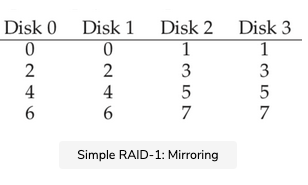

Our first RAID level beyond striping is known as RAID level 1, or mirroring. With a mirrored system, we simply make more than one copy of each block in the system; each copy should be placed on a separate disk, of course. By doing so, we can tolerate disk failures.

In a typical mirrored system, we will assume that for each logical block, the RAID keeps two physical copies of it. Here is an example:

In the example, disk 0 and disk 1 have identical contents, and disk 2 and disk 3 do as well; the data is striped across these mirror pairs. In fact, you may have noticed that there are a number of different ways to place block copies across the disks. The arrangement above is a common one and is sometimes called RAID-10 or (RAID 1+0) because it uses mirrored pairs (RAID-1) and then stripes (RAID-0) on top of them. Another common arrangement is RAID-01 (or RAID 0+1), which contains two large striping (RAID-0) arrays, and then mirrors (RAID-1) on top of them. For now, we will just talk about mirroring assuming the above layout.

When reading a block from a mirrored array, the RAID has a choice: it can read either copy. For example, if a read to logical block 5 is issued to the RAID, it is free to read it from either disk 2 or disk 3. When writing a block, though, no such choice exists: the RAID must update both copies of the data, in order to preserve reliability. Do note, though, that these writes can take place in parallel. For example, a write to logical block 5 could proceed to disks 2 and 3 at the same time.

## RAID-1 Analysis

### Capacity#

Let us assess RAID-1. From a capacity standpoint, RAID-1 is expensive; with the mirroring level = 2, we only obtain half of our peak useful capacity. With NNN disks of BBB blocks, RAID-1 useful capacity is (N.B)/2N. B)/2N.B)/2.

###  Reliability#

From a reliability standpoint, RAID-1 does well. It can tolerate the failure of any one disk. You may also notice RAID-1 can actually do better than this, with a little luck. Imagine, in the figure above, that disk 0 and disk 2 both failed. In such a situation, there is no data loss! More generally, a mirrored system (with mirroring level of 2) can tolerate 1 disk failure for certain, and up to N/2N/2N/2 failures depending on which disks fail. In practice, we generally don’t like to leave things like this to chance; thus most people consider mirroring to be good for handling a single failure.

### Performance

Finally, we analyze performance. From the perspective of the latency of a single read request, we can see it is the same as the latency on a single disk; all the RAID-1 does is direct the read to one of its copies. A write is a little different: it requires two physical writes to complete before it is done. These two writes happen in parallel, and thus the time will be roughly equivalent to the time of a single write; however, because the logical write must wait for both physical writes to complete, it suffers the worst-case seek and rotational delay of the two requests, and thus (on average) will be slightly higher than a write to a single disk.

ASIDE: THE RAID CONSISTENT-UPDATE PROBLEM

Before analyzing RAID-1, let us first discuss a problem that arises in any multi-disk RAID system, known as the consistent-update problem. The problem occurs on a write to any RAID that has to update multiple disks during a single logical operation. In this case, let us assume we are considering a mirrored disk array.

Imagine the write is issued to the RAID, and then the RAID decides that it must be written to two disks, disk 0 and disk 1. The RAID then issues the write to disk 0, but just before the RAID can issue the request to disk 1, a power loss (or system crash) occurs. In this unfortunate case, let us assume that the request to disk 0 completed (but clearly the request to disk 1 did not, as it was never issued).

The result of this untimely power loss is that the two copies of the block are now inconsistent; the copy on disk 0 is the new version, and the copy on disk 1 is old. What we would like to happen is for the state of both disks to change atomically, i.e., either both should end up as the new version or neither.

The general way to solve this problem is to use a write-ahead log of some kind to first record what the RAID is about to do (i.e., update two disks with a certain piece of data) before doing it. By taking this approach, we can ensure that in the presence of a crash, the right thing will happen. By running a recovery procedure that replays all pending transactions to the RAID, we can ensure that no two mirrored copies (in the RAID-1 case) are out of sync.

One last note: because logging to disk on every write is prohibitively expensive, most RAID hardware includes a small amount of non-volatile RAM (e.g., battery-backed) where it performs this type of logging. Thus, a consistent update is provided without the high cost of logging to disk.

To analyze steady-state throughput, let us start with the sequential workload. When writing out to disk sequentially, each logical write must result in two physical writes; for example, when we write logical block 0 (in the figure above), the RAID internally would write it to both disk 0 and disk 1. Thus, we can conclude that the maximum bandwidth obtained during sequential writing to a mirrored array is (N2.S\frac N 2 .S​2​​N​​.S), or half the peak bandwidth.

Unfortunately, we obtain the exact same performance during a sequential read. One might think that a sequential read could do better, because it only needs to read one copy of the data, not both. However, let’s use an example to illustrate why this doesn’t help much. Imagine we need to read blocks 0, 1, 2, 3, 4, 5, 6, and 7. Let’s say we issue the read of 0 to disk 0, the read of 1 to disk 2, the read of 2 to disk 1, and the read of 3 to disk 3. We continue by issuing reads to 4, 5, 6, and 7 to disks 0, 2, 1, and 3, respectively. One might naively think that because we are utilizing all disks, we are achieving the full bandwidth of the array.

To see that this is not (necessarily) the case, however, consider the requests a single disk receives (say disk 0). First, it gets a request for block 0; then, it gets a request for block 4 (skipping block 2). In fact, each disk receives a request for every other block. While it is rotating over the skipped block, it is not delivering useful bandwidth to the client. Thus, each disk will only deliver half its peak bandwidth. And thus, the sequential read will only obtain a bandwidth of (N2.S\frac N 2 .S​2​​N​​.S) MB/s.

Random reads are the best case for a mirrored RAID. In this case, we can distribute the reads across all the disks, and thus obtain the full possible bandwidth. Thus, for random reads, RAID-1 delivers N.RN.RN.R MB/s.

Finally, random writes perform as you might expect: N2.R\frac N 2. R​2​​N​​.R MB/s. Each logical write must turn into two physical writes, and thus while all the disks will be in use, the client will only perceive this as half the available bandwidth. Even though a write to logical block xxx turns into two parallel writes to two different physical disks, the bandwidth of many small requests only achieves half of what we saw with striping. As we will soon see, getting half the available bandwidth is actually pretty good!