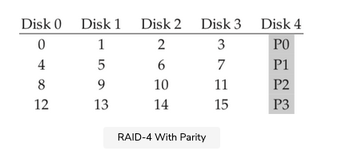
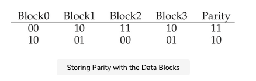

Saving Space With Parity

We now present a different method of adding redundancy to a disk array known as parity. Parity-based approaches attempt to use less capacity and thus overcome the huge space penalty paid by mirrored systems. They do so at a cost, however: performance.

Given below is an example five-disk RAID-4 system.

For each stripe of data, we have added a single parity block that stores the redundant information for that stripe of blocks. For example, parity block P1 has redundant information that it calculated from blocks 4, 5, 6, and 7.

To compute parity, we need to use a mathematical function that enables us to withstand the loss of anyone block from our stripe. It turns out the simple function XOR does the trick quite nicely. For a given set of bits, the XOR of all of those bits returns a 0 if there are an even number of 1’s in the bits, and a 1 if there are an odd number of 1’s. For example:

In the first row (0,0,1,1), there are two 1’s (C2, C3), and thus XOR of all of those values will be 0 (P ). Similarly, in the second row there is only one 1 (C1), and thus the XOR must be 1 (P ). You can remember this in a simple way: that the number of 1s in any row, including the parity bit, must be an even (not odd) number; that is the invariant that the RAID must maintain in order for parity to be correct.

From the example above, you might also be able to guess how parity information can be used to recover from a failure. Imagine the column labeled C2 is lost. To figure out what values must have been in the column, we simply have to read in all the other values in that row (including the XOR’d parity bit) and reconstruct the right answer. Specifically, assume the first row’s value in column C2 is lost (it is a 1). By reading the other values in that row (0 from C0, 0 from C1, 1 from C3, and 0 from the parity column P), we get the values 0, 0, 1, and 0. Because we know that XOR keeps an even number of 1’s in each row, we know what the missing data must be a 1. And that is how reconstruction works in a XOR-based parity scheme! Note also how we compute the reconstructed value: we just XOR the data bits and the parity bits together, in the same way that we calculated the parity in the first place.

Now you might be wondering that why are we talking about XORing all of these bits, and yet from above we know that the RAID places 4KB (or larger) blocks on each disk. How do we apply XOR to a bunch of blocks to compute the parity? It turns out this is easy as well. Simply perform a bitwise XOR across each bit of the data blocks; put the result of each bitwise XOR into the corresponding bit slot in the parity block. For example, if we had blocks of size 4 bits (yes, this is still quite a bit smaller than a 4KB block, but you get the picture), they might look something like this:

As you can see from the figure, the parity is computed for each bit of each block and the result placed in the parity block.

## RAID-4 analysis#

### Capacity
Let us now analyze RAID-4. From a capacity standpoint, RAID-4 uses 1 disk for parity information for every group of disks it is protecting. Thus, our useful capacity for a RAID group is (NNN − 111).BBB.

### Reliability#

Reliability is also quite easy to understand: RAID-4 tolerates 1 disk failure and no more. If more than one disk is lost, there is simply no way to reconstruct the lost data.

### Performance#

Finally, there is performance. This time, let us start by analyzing steady-state throughput. Sequential read performance can utilize all of the disks except for the parity disk, and thus deliver a peak effective bandwidth of (NNN − 111).SSS MB/s (an easy case).

To understand the performance of sequential writes, we must first understand how they are done. When writing a big chunk of data to disk, RAID-4 can perform a simple optimization known as a full-stripe write. For example, imagine the case where the blocks 0, 1, 2, and 3 have been sent to the RAID as part of a write request as shown below:

In this case, the RAID can simply calculate the new value of P0 (by performing an XOR across the blocks 0, 1, 2, and 3) and then write all of the blocks (including the parity block) to the five disks above in parallel (highlighted in gray in the figure). Thus, full-stripe writes are the most efficient way for RAID-4 to write to disk.

Once we understand the full-stripe write, calculating the performance of sequential writes on RAID-4 is easy; the effective bandwidth is also (NNN − 111).SSS MB/s. Even though the parity disk is constantly in use during the operation, the client does not gain performance advantage from it.

Now let us analyze the performance of random reads. As you can also see from the figure above, a set of 1-block random reads will be spread across the data disks of the system but not the parity disk. Thus, the effective performance is: (NNN − 111).RRR MB/s.

Random writes, which we have saved for last, present the most interesting case for RAID-4. Imagine we wish to overwrite block 1 in the example above. We could just go ahead and overwrite it, but that would leave us with a problem: the parity block P0 would no longer accurately reflect the correct parity value of the stripe; in this example, P0 must also be updated. How can we update it both correctly and efficiently?

It turns out there are two methods. The first, known as additive parity, requires us to do the following. To compute the value of the new parity block, read in all of the other data blocks in the stripe in parallel (in the example, blocks 0, 2, and 3) and XOR those with the new block (1). The result is your new parity block. To complete the write, you can then write the new data and new parity to their respective disks, also in parallel.

The problem with this technique is that it scales with the number of disks, and thus in larger RAIDs requires a high number of reads to compute parity. Thus, the subtractive parity method.

For example, imagine this string of bits (4 data bits, one parity):

Because we are dealing with blocks, not bits, we perform this calculation over all the bits in the block (e.g., 4096 bytes in each block multiplied by 8 bits per byte). Thus, in most cases, the new block will be different than the old block and thus the new parity block will too.

You should now be able to figure out when we would use the additive parity calculation and when we would use the subtractive method. Think about how many disks would need to be in the system so that the additive method performs fewer I/Os than the subtractive method; what is the crossover point?

For this performance analysis, let us assume we are using the subtractive method. Thus, for each write, the RAID has to perform 4 physical I/Os (two reads and two writes). Now imagine there are lots of writes submitted to the RAID; how many can RAID-4 perform in parallel? To understand, let us again look at the RAID-4 layout given below.
svg viewer

Now imagine there were 2 small writes submitted to the RAID-4 at about the same time, to blocks 4 and 13 (marked with ∗ in the diagram). The data for those disks is on disks 0 and 1, and thus the read and write to data could happen in parallel, which is good. The problem that arises is with the parity disk; both the requests have to read the related parity blocks for 4 and 13, parity blocks 1 and 3 (marked with +). Hopefully, the issue is now clear: the parity disk is a bottleneck under this type of workload; we sometimes thus call this the small-write problem for parity-based RAIDs. Thus, even though the data disks could be accessed in parallel, the parity disk prevents any parallelism from materializing; all writes to the system will be serialized because of the parity disk. Because the parity disk has to perform two I/Os (one read, one write) per logical I/O, we can compute the performance of small random writes in RAID-4 by computing the parity disk’s performance on those two I/Os, and thus we achieve (R2\frac R2​2​​R​​) MB/s. RAID-4 throughput under random small writes is terrible; it does not improve as you add disks to the system.

We conclude by analyzing I/O latency in RAID-4. As you now know, a single read (assuming no failure) is just mapped to a single disk, and thus its latency is equivalent to the latency of a single disk request. The latency of a single write requires two reads and then two writes. The reads can happen in parallel, as can the writes, and thus total latency is about twice that of a single disk (with some differences because we have to wait for both reads to complete and thus get the worst-case positioning time, but then the updates don’t incur seek cost and thus may be a better-than-average positioning cost).

