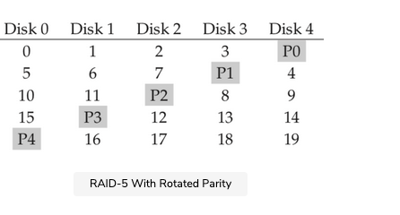

This lesson presents RAID level 5, an improvement over level 4, and analyzes it with respect to the capacity, reliability, and performance.

To address the small-write problem (at least, partially), Patterson, Gibson, and Katz introduced RAID-5. RAID-5 works almost identically to RAID-4, except that it rotates the parity block across drives. Look at the figure given below:

 

As you can see, the parity block for each stripe is now rotated across the disks, in order to remove the parity-disk bottleneck for RAID-4.

## RAID-5 Analysis

Much of the analysis for RAID-5 is identical to RAID-4. For example, the effective capacity and failure tolerance of the two levels are identical. So are sequential read and write performance. The latency of a single request (whether a read or a write) is also the same as RAID-4.

### Random read performance#

Random read performance is a little better, because we can now utilize all disks. Finally, random write performance improves noticeably over RAID-4, as it allows for parallelism across requests. Imagine a write to block 1 and a write to block 10. This will turn into requests to disk 1 and disk 4 (for block 1 and its parity) and requests to disk 0 and disk 2 (for block 10 and its parity). Thus, they can proceed in parallel. In fact, we can generally assume that given a large number of random requests, we will be able to keep all the disks about evenly busy. If that is the case, then our total bandwidth for small writes will be N4.R\frac N 4.R​4​​N​​.R MB/s. The factor of four loss is due to the fact that each RAID-5 write still generates 4 total I/O operations, which is simply the cost of using parity-based RAID.

Because RAID-5 is basically identical to RAID-4 except in the few cases where it is better, it has almost completely replaced RAID-4 in the marketplace. The only place where it has not is in systems that know they will never perform anything other than a large write, thus avoiding the small-write problem altogether. In those cases, RAID-4 is sometimes used as it is slightly simpler to build.

