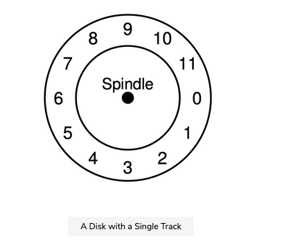
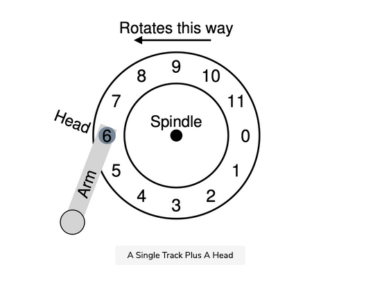
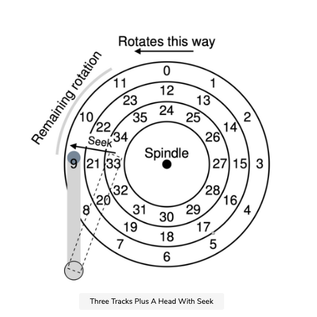

Let’s start by understanding the interface to a modern disk drive. The basic interface for all modern drives is straightforward. The drive consists of a large number of sectors (512-byte blocks), each of which can be read or written. The sectors are numbered from 000 to n−1n-1n−1 on a disk with nnn sectors. Thus, we can view the disk as an array of sectors; 000 to n−1n-1n−1 is thus the address space of the drive.

Multi-sector operations are possible; indeed, many file systems will read or write 4KB at a time (or more). However, when updating the disk, the only guarantee drive manufacturers make is that a single 512-byte write is atomic (i.e., it will either complete in its entirety or won’t complete at all). Thus, if an untimely power loss occurs, only a portion of a larger write may complete (sometimes called a torn write).

There are some assumptions most clients of disk drives make, but those are not specified directly in the interface. Schlosser and Ganger have called this the “unwritten contract” of disk drives. Specifically, one can usually assume that accessing two blocks near one-another within the drive’s address space will be faster than accessing two blocks that are far apart. One can also usually assume that accessing blocks in a contiguous chunk (i.e., a sequential read or write) is the fastest access mode, and usually much faster than any more random access pattern.

## Basic geometry

Let’s start to understand some of the components of a modern disk. We start with a platter, a hard circular surface on which data is stored persistently by inducing magnetic changes to it. A disk may have one or more platters; each platter has two sides, each of which is called a surface. These platters are usually made of some hard material (such as aluminum), and then coated with a thin magnetic layer that enables the drive to persistently store bits even when the drive is powered off.

### platters

The platters are all bound together around the spindle, which is connected to a motor that spins the platters around, while the drive is powered on, at a fixed rate. The rate of rotation is often measured in rotations per minute (RPM), and typical modern values are in the 7,200 RPM to 15,000 RPM range. Note that we will often be interested in the time of a single rotation, e.g., a drive that rotates at 10,000 RPM means that a single rotation takes about 6 milliseconds (6 ms).

### Track

Data is encoded on each surface in concentric circles of sectors; we call one such concentric circle a track. A single surface contains many thousands and thousands of tracks, tightly packed together, with hundreds of tracks fitting into the width of a human hair.

To read and write from the surface, we need a mechanism that allows us to either sense (i.e., read) the magnetic patterns on the disk or to induce a change in (i.e., write) them. This process of reading and writing is accomplished by the disk head; there is one such head per surface of the drive. The disk head is attached to a single disk arm, which moves across the surface to position the head over the desired track.

## A simple Disk Drive

Let’s understand how disks work by building up a model one track at a time. Assume we have a simple disk with a single track as the following figure shows.

This track has just 12 sectors, each of which is 512 bytes in size (our typical sector size, recall) and addressed therefore by the numbers 0 through 11. The single platter we have here rotates around the spindle, to which a motor is attached.

Of course, the track by itself isn’t too interesting; we want to be able to read or write those sectors, and thus we need a disk head, attached to a disk arm, as we now see in the figure below.

In the figure, the disk head, attached to the end of the arm, is positioned over sector 6, and the surface is rotating counter-clockwise.

### Single-track latency: the rotational delay#

To understand how a request would be processed on our simple, one-track disk, imagine we now receive a request to read block 0. How should the disk service this request?

In our simple disk, the disk doesn’t have to do much. In particular, it must just wait for the desired sector to rotate under the disk head. This wait happens often enough in modern drives, and is an important enough component of I/O service time, that it has a special name: rotational delay (sometimes rotation delay, though that sounds weird). In the example, if the full rotational delay is RRR, the disk has to incur a rotational delay of about R2\frac{R}{2}​2​​R​​ to wait for 000 to come under the read/write head (if we start at 6). A worst-case request on this single track would be to sector 5, causing nearly a full rotational delay in order to service such a request.

## A Disk Drive with Multiple Tracks: Seek Time

So far our disk just had a single track, which is not too realistic; modern disks of course have many millions. Let’s thus look at an ever-so-slightly more realistic disk surface, this one with three tracks. Look at the figure given below.

In the figure, the head is currently positioned over the innermost track, which contains sectors 24 through 35. The next track over contains the next set of sectors (12 through 23), and the outermost track contains the first sectors (0 through 11).

To understand how the drive might access a given sector, we now trace what would happen on a request to a distant sector, e.g., a read to sector 11. To service this read, the drive has to first move the disk arm to the correct track (in this case, the outermost one), in a process known as a seek. Seeks, along with rotations, are one of the most costly disk operations.

The seek, it should be noted, has many phases:

- First, an acceleration phase as the disk arm gets moving.
- Then coasting as the arm is moving at full speed.
- Then deceleration as the arm slows down
- Finally settling as the head is carefully positioned over the correct track.

The settling time is often quite significant, e.g., 0.5 to 2 ms, as the drive must be certain to find the right track (imagine if it just got close instead!).

After the seek, the disk arm has positioned the head over the right track. A depiction of the seek is found in the figure below.

As we can see, during the seek, the arm has been moved to the desired track, and the platter of course has rotated, in this case about 3 sectors. Thus, sector 9 is just about to pass under the disk head, and we must only endure a short rotational delay to complete the transfer.

When sector 11 passes under the disk head, the final phase of I/O will take place, known as the transfer, where data is either read from or written to the surface. And thus, we have a complete picture of I/O time: first, a seek, then waiting for the rotational delay, and finally the transfer.