## Journaling (or Write-Ahead Logging)

Probably the most popular solution to the consistent update problem is to steal an idea from the world of database management systems. That idea, known as write-ahead logging, was invented to address exactly this type of problem. In file systems, we usually call write-ahead logging journaling for historical reasons. The first file system to do this was Cedar, though many modern file systems use the idea, including Linux ext3 and ext4, reiserfs, IBM’s JFS, SGI’s XFS, and Windows NTFS.

The basic idea is as follows. When updating the disk, before overwriting the structures in place, first write down a little note (somewhere else on the disk, in a well-known location) describing what you are about to do. Writing this note is the “write ahead” part, and we write it to a structure that we organize as a “log”; hence, write-ahead logging.

By writing the note to disk, you are guaranteeing that if a crash takes places during the update (overwrite) of the structures you are updating, you can go back and look at the note you made and try again. Thus, you will know exactly what to fix (and how to fix it) after a crash, instead of having to scan the entire disk. By design, journaling thus adds a bit of work during updates to greatly reduce the amount of work required during recovery.

We’ll now describe how Linux ext3, a popular journaling file system, incorporates journaling into the file system. Most of the on-disk structures are identical to Linux ext2, e.g., the disk is divided into block groups, and each block group contains an inode bitmap, data bitmap, inodes, and data blocks. The new key structure is the journal itself, which occupies some small amount of space within the partition or on another device. Thus, an ext2 file system (without journaling) looks like this:

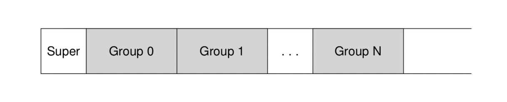

Assuming the journal is placed within the same file system image (though sometimes it is placed on a separate device, or as a file within the file system), an ext3 file system with a journal looks like this:

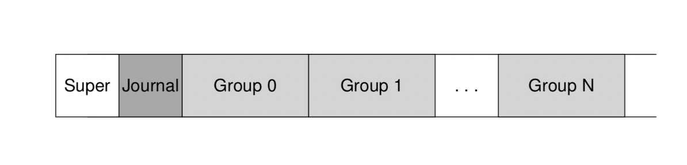

## Data journaling

Let’s look at a simple example to understand how data journaling works. Data journaling is available as a mode with the Linux ext3 file system, from which much of this discussion is based.

Say we have our canonical update again, where we wish to write the inode (I[v2]), bitmap (B[v2]), and data block (Db) to disk again. Before writing them to their final disk locations, we are now first going to write them to the log (a.k.a. journal). This is what this will look like in the log:

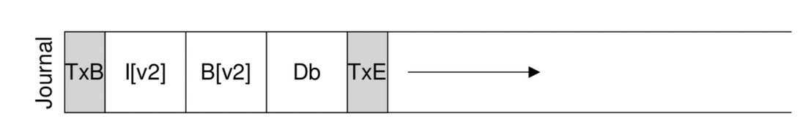

You can see we have written five blocks here. The transaction begin (TxB) tells us about this update, including information about the pending update to the file system (e.g., the final addresses of the blocks I[v2], B[v2], and Db), and some kind of transaction identifier (TID). The middle three blocks just contain the exact contents of the blocks themselves; this is known as physical logging as we are putting the exact physical contents of the update in the journal (an alternate idea, logical logging, puts a more compact logical representation of the update in the journal, e.g., “this update wishes to append data block Db to file X”, which is a little more complex but can save space in the log and perhaps improve performance). The final block (TxE) is a marker of the end of this transaction, and will also contain the TID.

Once this transaction is safely on disk, we are ready to overwrite the old structures in the file system; this process is called checkpointing. Thus, to checkpoint the file system (i.e., bring it up to date with the pending update in the journal), we issue the writes I[v2], B[v2], and Db to their disk locations as seen above; if these writes complete successfully, we have successfully checkpointed the file system and are basically done. Thus, our initial sequence of operations:

1. Journal write: Write the transaction, including a transaction-begin block, all pending data and metadata updates, and a transaction-end block, to the log; wait for these writes to complete.

2. Checkpoint: Write the pending metadata and data updates to their final locations in the file system.

In our example, we would write TxB, I[v2], B[v2], Db, and TxE to the journal first. When these writes complete, we would complete the update by checkpointing I[v2], B[v2], and Db, to their final locations on disk.

Things get a little trickier when a crash occurs during the writes to the journal. Here, we are trying to write the set of blocks in the transaction (e.g., TxB, I[v2], B[v2], Db, TxE) to disk. One simple way to do this would be to issue each one at a time, waiting for each to complete, and then issuing the next. However, this is slow. Ideally, we’d like to issue all five block writes at once, as this would turn five writes into a single sequential write and thus be faster. However, this is unsafe, for the following reason: given such a big write, the disk internally may perform scheduling and complete small pieces of the big write in any order. Thus, the disk internally may (1) write TxB, I[v2], B[v2], and TxE and only later (2) write Db. Unfortunately, if the disk loses power between (1) and (2), this is what ends up on disk:

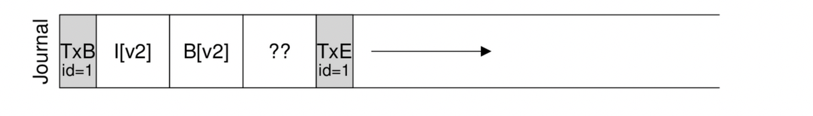

Why is this a problem? Well, the transaction looks like a valid transaction (it has a begin and an end with matching sequence numbers). Further, the file system can’t look at that fourth block and know it is wrong; after all, it is arbitrary user data. Thus, if the system now reboots and runs recovery, it will replay this transaction, and ignorantly copy the contents of the garbage block ’??’ to the location where Db is supposed to live. This is bad for arbitrary user data in a file; it is much worse if it happens to a critical piece of the file system, such as the superblock, which could render the file system unmountable.

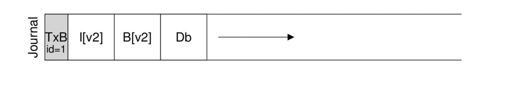

To avoid the problem mentioned above, the file system issues the transactional write in two steps. First, it writes all blocks except the TxE block to the journal, issuing these writes all at once. When these writes complete, the journal will look something like this (assuming our append workload again):

When those writes complete, the file system issues the write of the TxE block, thus leaving the journal in this final, safe state:

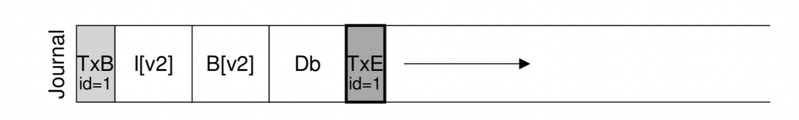

An important aspect of this process is the atomicity guarantee provided by the disk. It turns out that the disk guarantees that any 512-byte write will either happen or not (and never be half-written); thus, to make sure the write of TxE is atomic, one should make it a single 512-byte block. Thus, our current protocol to update the file system, with each of its three phases labeled:

1. Journal write: Write the contents of the transaction (including TxB, metadata, and data) to the log; wait for these writes to complete.

2. Journal commit: Write the transaction commit block (containing TxE) to the log; wait for write to complete; the transaction is said to be committed.

3. Checkpoint: Write the contents of the update (metadata and data) to their final on-disk locations.

## Recovery

Let’s now understand how a file system can use the contents of the journal to recover from a crash. A crash may happen at any time during this sequence of updates. If the crash happens before the transaction is written safely to the log (i.e., before Step 2 above completes), then our job is easy: the pending update is simply skipped. If the crash happens after the transaction has committed to the log, but before the checkpoint is complete, the file system can recover the update as follows. When the system boots, the file system recovery process will scan the log and look for transactions that have committed to the disk; these transactions are thus replayed (in order), with the file system again attempting to write out the blocks in the transaction to their final on-disk locations. This form of logging is one of the simplest forms there is, and is called redo logging. By recovering the committed transactions in the journal, the file system ensures that the on-disk structures are consistent, and thus can proceed by mounting the file system and readying itself for new requests.

Note that it is fine for a crash to happen at any point during checkpointing, even after some of the updates to the final locations of the blocks have completed. In the worst case, some of these updates are simply performed again during recovery. Because recovery is a rare operation (only taking place after an unexpected system crash), a few redundant writes are nothing to worry about.

## Batching log updates#

You might have noticed that the basic protocol could add a lot of extra disk traffic. For example, imagine we create two files in a row, called file1 and file2, in the same directory. To create one file, one has to update a number of on-disk structures, minimally including: the inode bitmap (to allocate a new inode), the newly-created inode of the file, the data block of the parent directory containing the new directory entry, and the parent directory inode (which now has a new modification time). With journaling, we logically commit all of this information to the journal for each of our two file creations because the files are in the same directory, and assuming they even have inodes within the same inode block, this means that if we’re not careful, we’ll end up writing these same blocks over and over.

To remedy this problem, some file systems do not commit each update to disk one at a time (e.g., Linux ext3); rather, one can buffer all updates into a global transaction. In our example above, when the two files are created, the file system just marks the in-memory inode bitmap, inodes of the files, directory data, and directory inode as dirty, and adds them to the list of blocks that form the current transaction. When it is finally time to write these blocks to disk (say, after a timeout of 5 seconds), this single global transaction is committed containing all of the updates described above. Thus, by buffering updates, a file system can avoid excessive write traffic to disk in many cases.

## Making the log finite

We thus have arrived at a basic protocol for updating file-system on-disk structures. The file system buffers updates in memory for some time; when it is finally time to write to disk, the file system first carefully writes out the details of the transaction to the journal (a.k.a. write-ahead log); after the transaction is complete, the file system checkpoints those blocks to their final locations on disk.

However, the log is of a finite size. If we keep adding transactions to it (as in this figure), it will soon fill. What do you think happens then?

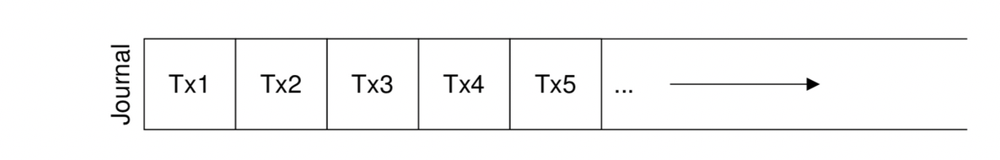

Two problems arise when the log becomes full. The first is simpler, but less critical: the larger the log, the longer recovery will take, as the recovery process must replay all the transactions within the log (in order) to recover. The second is more of an issue: when the log is full (or nearly full), no further transactions can be committed to the disk, thus making the file system “less than useful” (i.e., useless).

To address these problems, journaling file systems treat the log as a circular data structure, re-using it over and over; this is why the journal is sometimes referred to as a circular log. To do so, the file system must take action sometime after a checkpoint. Specifically, once a transaction has been checkpointed, the file system should free the space it was occupying within the journal, allowing the log space to be reused. There are many ways to achieve this end; for example, you could simply mark the oldest and newest non-checkpointed transactions in the log in a journal superblock; all other space is free. Here is a graphical depiction:

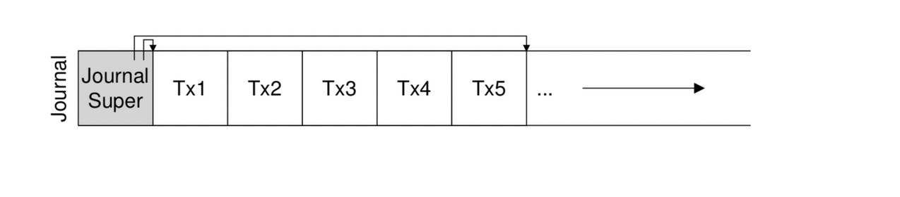

In the journal superblock (not to be confused with the main file system superblock), the journaling system records enough information to know which transactions have not yet been checkpointed, and thus reduces recovery time as well as enables re-use of the log in a circular fashion. And thus we add another step to our basic protocol:

1. Journal write: Write the contents of the transaction (containingTxB and the contents of the update) to the log; wait for these writes to complete.

2. Journal commit: Write the transaction commit block (containing TxE) to the log; wait for the write to complete; the transaction is now committed.

3. Checkpoint: Write the contents of the update to their final locations within the file system.

4. Free: Sometime later, mark the transaction free in the journal by updating the journal superblock.

Thus we have our final data journaling protocol. But there is still a problem: we are writing each data block to the disk twice, which is a heavy cost to pay, especially for something as rare as a system crash.

# Metadata journaling

Although recovery is now fast (scanning the journal and replaying a few transactions as opposed to scanning the entire disk), normal operation of the file system is slower than we might desire. In particular, for each write to disk, we are now also writing to the journal first, thus doubling write traffic; this doubling is especially painful during sequential write workloads, which now will proceed at half the peak write bandwidth of the drive. Further, between writes to the journal and writes to the main file system, there is a costly seek, which adds noticeable overhead for some workloads.

Because of the high cost of writing every data block to disk twice, people have tried a few different things in order to speed up performance. For example, the mode of journaling we described in the previous lesson is often called data journaling (as in Linux ext3), as it journals all user data (in addition to the metadata of the file system). A simpler (and more common) form of journaling is sometimes called ordered journaling (or just metadata journaling), and it is nearly the same, except that user data is not written to the journal. Thus, when performing the same update as above, the following information would be written to the journal:

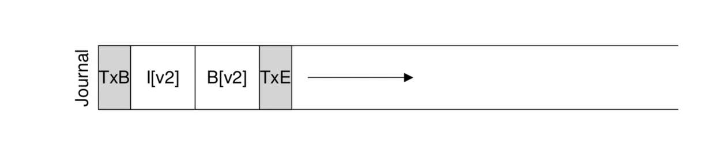

The data block Db, previously written to the log, would instead be written to the file system proper, avoiding the extra write. Given that most I/O traffic to the disk is data, not writing data twice substantially reduces the I/O load of journaling. The modification does raise an interesting question, though: when should we write data blocks to disk?

Let’s again consider our example append of a file to understand the problem better. The update consists of three blocks: I[v2], B[v2], and Db. The first two are both metadata and will be logged and then checkpointed; the latter will only be written once to the file system. When should we write Db to disk? Does it matter?

As it turns out, the ordering of the data write does matter for metadata-only journaling. For example, what if we write Db to disk after the transaction (containing I[v2] and B[v2]) completes? Unfortunately, this approach has a problem: the file system is consistent but I[v2] may end up pointing to garbage data. Specifically, consider the case where I[v2] and B[v2] are written but Db did not make it to disk. The file system will then try to recover. Because Db is not in the log, the file system will replay writes to I[v2] and B[v2], and produce a consistent file system (from the perspective of file-system metadata). However, I[v2] will be pointing to garbage data, i.e., at whatever was in the slot where Db was headed.

To ensure this situation does not arise, some file systems (e.g., Linux ext3) write data blocks (of regular files) to the disk first, before related metadata is written to disk. Specifically, the protocol is as follows:

   1. Data write: Write data to final location; wait for completion (the wait is optional; see below for details).
   2. Journal metadata write: Write the begin block and metadata to the log; wait for writes to complete.
   3. Journal commit: Write the transaction commit block (containing TxE) to the log; wait for the write to complete; the transaction (including data) is now committed.
   4. Checkpoint metadata: Write the contents of the metadata update to their final locations within the file system.
   5. Free: Later, mark the transaction free in journal superblock.

By forcing the data write first, a file system can guarantee that a pointer will never point to garbage. Indeed, this rule of “write the pointed-to object before the object that points to it” is at the core of crash consistency, and is exploited even further by other crash consistency schemes

In most systems, metadata journaling (akin to ordered journaling of ext3) is more popular than full data journaling. For example, Windows NTFS and SGI’s XFS both use some form of metadata journaling. Linux ext3 gives you the option of choosing either data, ordered, or unordered modes (in unordered mode, data can be written at any time). All of these modes keep metadata consistent; they vary in their semantics for data.

Finally, note that forcing the data write to complete (Step 1) before issuing writes to the journal (Step 2) is not required for correctness, as indicated in the protocol above. Specifically, it would be fine to concurrently issue writes to data, the transaction-begin block, and journaled metadata; the only real requirement is that Steps 1 and 2 complete before the issuing of the journal commit block (Step 3).

## Tricky case: block reuse#

There are some interesting corner cases that make journaling more tricky, and thus are worth discussing. A number of them revolve around block reuse; as Stephen Tweedie (one of the main forces behind ext3) said:

“What’s the hideous part of the entire system? … It’s deleting files. Everything to do with delete is hairy. Everything to do with delete… you have nightmares around what happens if blocks get deleted and then reallocated.”

The particular example Tweedie gives is as follows. Suppose you are using some form of metadata journaling (and thus data blocks for files are not journaled). Let’s say you have a directory called foo. The user adds an entry to foo (say by creating a file), and thus the contents of foo (because directories are considered metadata) are written to the log; assume the location of the foo directory data is block 1000. The log thus contains something like this:

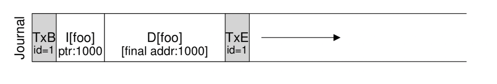

At this point, the user deletes everything in the directory and the directory itself, freeing up block 1000 for reuse. Finally, the user creates a new file (say bar), which ends up reusing the same block (1000) that used to belong to foo. The inode of bar is committed to disk, as is its data. Note, however, because metadata journaling is in use, only the inode of bar is committed to the journal; the newly-written data in block 1000 in the file bar is not journaled.

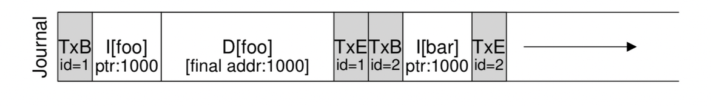

Now assume a crash occurs and all of this information is still in the log. During replay, the recovery process simply replays everything in the log, including the write of directory data in block 1000; the replay thus overwrites the user data of current file bar with old directory contents! Clearly this is not a correct recovery action, and certainly, it will be a surprise to the user when reading the file bar.

There are a number of solutions to this problem. One could, for example, never reuse blocks until the delete of said blocks is checkpointed out of the journal. What Linux ext3 does instead is to add a new type of record to the journal, known as a revoke record. In the case above, deleting the directory would cause a revoke record to be written to the journal. When replaying the journal, the system first scans for such revoke records; any such revoked data is never replayed, thus avoiding the problem mentioned above.

## Wrapping up journaling: a timeline#

Before ending our discussion of journaling, we summarize the protocols we have discussed with timelines depicting each of them. The figure below shows the protocol when journaling data and metadata.

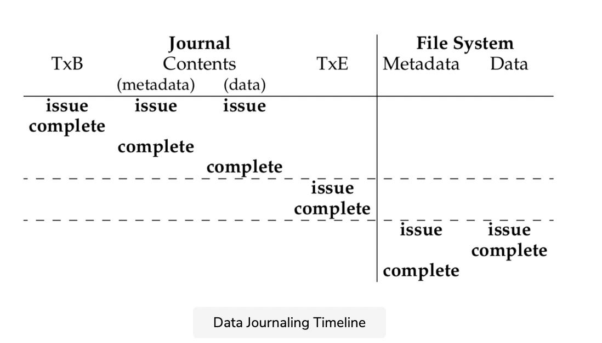

The figure below shows the protocol when journaling only metadata:

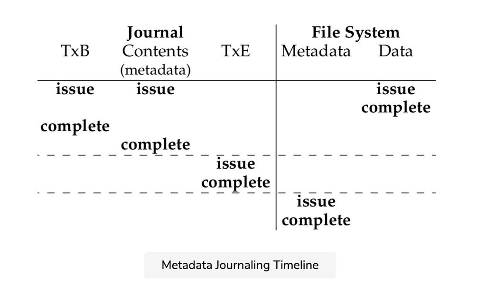

In each figure, time increases in the downward direction, and each row in the figure shows the logical time that a write can be issued or might complete. For example, in the data journaling protocol, the writes of the transaction begin block (TxB) and the contents of the transaction can logically be issued at the same time, and thus can be completed in any order. However, the write to the transaction end block (TxE) must not be issued until said previous writes complete. Similarly, the checkpointing writes to data and metadata blocks cannot begin until the transaction end block has committed. Horizontal dashed lines show where write-ordering requirements must be obeyed.

A similar timeline is shown for the metadata journaling protocol. Note that the data write can logically be issued at the same time as the writes to the transaction begin and the contents of the journal. However, it must be issued and complete before the transaction end has been issued.

Finally, note that the time of completion marked for each write in the timelines is arbitrary. In a real system, completion time is determined by the I/O subsystem, which may reorder writes to improve performance. The only guarantees about ordering that we have are those that must be enforced for protocol correctness (and are shown via the horizontal dashed lines in the figures).
