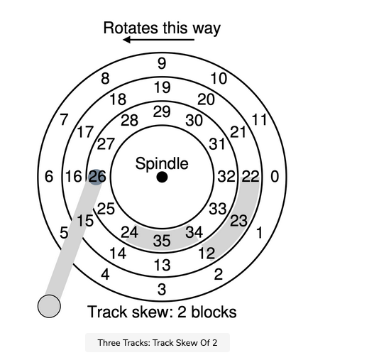

## Track skew

Many drives employ some kind of track skew to make sure that sequential reads can be properly serviced even when crossing track boundaries. In our simple example
disk, this might appear as seen in the figure below.

Sectors are often skewed like this because when switching from one track to another, the disk needs time to reposition the head (even to neighboring tracks). Without such skew, the head would be moved to the next track but the desired next block would have already rotated under the head, and thus the drive would have to wait almost the entire rotational delay to access the next block.

## Multi-zoned disk drives#

Another reality is that outer tracks tend to have more sectors than inner tracks, which is a result of geometry; there is simply more room out there. These tracks are often referred to as multi-zoned disk drives, where the disk is organized into multiple zones, and where a zone is consecutive set of tracks on a surface. Each zone has the same number of sectors per track, and outer zones have more sectors than inner zones.

## Cache

Finally, an important part of any modern disk drive is its cache, for historical reasons sometimes called a track buffer. This cache is just some small amount of memory, usually around 8 or 16 MB, which the drive can use to hold data read from or written to the disk. For example, when reading a sector from the disk, the drive might decide to read in all of the sectors on that track and cache them in its memory; doing so allows the drive to quickly respond to any subsequent requests to the same track.

On writes, the drive has a choice: should it acknowledge the write has completed when it has put the data in its memory, or after the write has actually been written to disk? The former is called write back caching (or sometimes immediate reporting), and the latter write through. Write back caching sometimes makes the drive appear “faster”, but can be dangerous; if the file system or applications require that data be written to disk in a certain order for correctness, write-back caching can lead to problems (read the chapter on file-system journaling for details).

ASIDE: DIMENSIONAL ANALYSIS

