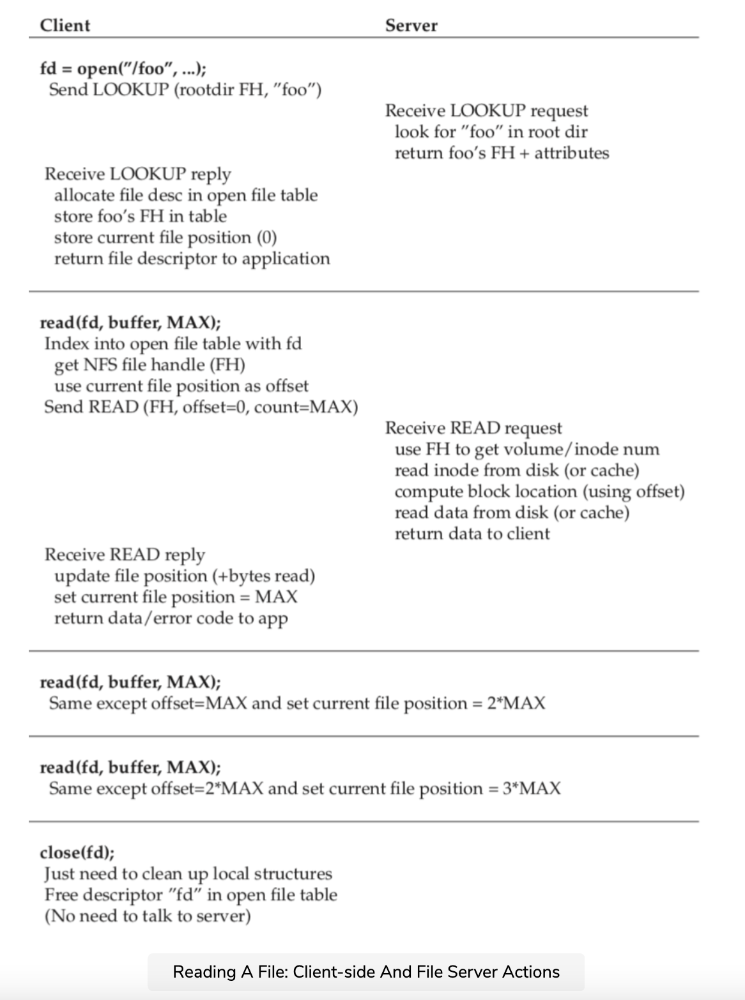
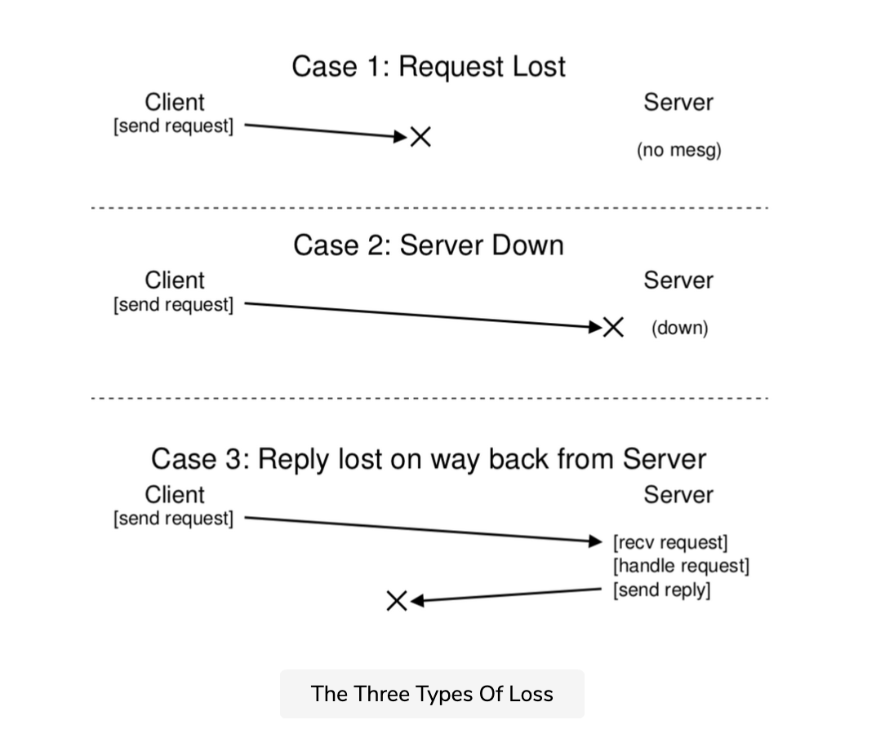

## File handle

one key to understanding the design of the NFS protocol is understanding the file handle. File handles are used to uniquely describe the file or directory a particular operation is going to operate upon; thus, many of the protocol requests include a file handle.

You can think of a file handle as having three important components.

1. a volume identifier.
2. an inode number.
3. a generation number.

Together, these three items comprise a unique identifier for a file or directory that a client wishes to access.
The volume identifier informs the server which file system the request refers to (an NFS server can export more than one file system). The inode number tells the server which file within that partition the request is accessing. Finally, the generation number is needed when reusing an inode number; by incrementing it whenever an inode number is reused.
the server ensures that a client with an old file handle can't accidentally access the newly-allocated file.

Here is a summary of some of the important pieces of the protocol; the full protocol is available elsewhere.

NFSPROC_GETATTR  file handle
                 returns; attributes
NFSPROC_SETATTR   file handle, attributes
                 returns: -
NFSPROC_LOOKUP   directory file handle, name of file/dir to lookup
                 returns: file handle

NFSPROC_READ     file handle, offset, count, data
                 attributes

NFSPROC_WRITE    file handle, offset, count, data, 
                 attributes

NFSPROC_CREATE   directory file handle, name of file, attributes
                 - 

NFSPROC_REMOVE   directory file handle, name of file to be removed
                -

NFSPROC_MKDIR    directory file handle, name of directory, attributes
                 file handle

NFSPROC_RMDIR    directory file handle, name of directory to be removed
                 -

NFSPROC_READDIR  directory handle, count of bytes to read, cookie
                 returns: directory entires, cookie(to get more entries)

## LOOKUP protocol

We briefly highlight the important components of the protocol. First, the LOOKUP protocol message is used to obtain a file handle, which is then subsequently used to access file data. The client passes a directory file handle and name of a file to look up, and the handle to that file (or directory) plus its attributes are passed back to the client from the server.

For example, assume the client already has a directory file handle for the root directory of a file system (/)  (indeed, this would be obtained through the NFS mount protocol, NFS mount protocol, which is how clients and servers first are connected together; we do not discuss the mount protocol here for sake of brevity). If an application running on the client opens the file .foo.txt, the client-side file system sends a lookup request to the server, passing it the root file handle and the name foo.txt; if successful, the file handle (and attributes) for foo.txt will be returned.

In case you are wondering, attributes are just the metadata that the file system tracks about each file, including fields such as file creation time, last modification time, size, ownership, and permissions information, and so forth, i.e., the same type of information that you would get back if you called stat() on a file.

## READ and WRITE protocols

Once a file handle is available, the client can issue READ and WRITE protocol messages on a file to read or write the file, respectively. The READ protocol message requires the protocol to pass along the file handle of the file with the offset within the file and the number of bytes to read. The server then will be able to issue the read (after all, the handle tells the server which volume and which inode to read from, and the offset and count tells it which bytes of the file to read) and return the data to the client ( or an error if there was a failure). WRITE is handled similarly, except the data is passed from the client to the server, and just a success code is returned.

## GETATTR protocol

One last interesting protocol message is the GETATTR request; given a file handle, it simply fetches the attributes for that file, including the last modified time of the file. We will see why this protocol requeset is important in NFSv2 ahead when we discuss caching (can you guess why?).

Hopefully, you are now getting some sense of how this protocol is turned into a file system across the client-side file system and the file server. The client-side file system tracks open files and generally translates application requests into the relevant set of protocol messages. The server simply responds to protocol messages, each of which contains all information needed to complete the request.

## Reading a A file 

For example, let us consider a simple application that reads a file. In the diagram below, we show what system calls the application makes, and what the client-side file system and file server do in responding to such calls.

A few comments about the figure. First, notice how the client tracks all relevant state for the file access, including the mapping of the integer file descriptor to an NFS file handle as well as the current file pointer. This enables the client to turn each read request (which you may have noticed do not specify the offset to read from explicitly) into a properly-formatted read protocol message which tells the server exactly which bytes from the file to read. Upon a successful read, the client updates the current file position; subsequent reads are issued with the same file handle but a different offset.

Second, you may notice where server interactions occur. When the file is opened for the first time, the client-side file system sends a LOOKUP request message. Indeed, if a long pathname must be traversed (e.g., /home/remzi/foo.txt), the client would send three LOOKUPs: one to look up home in the directory /, one to look up remzi in home, and finally, one to look up foo.txt in remzi.

Third, you may notice how each server request has all the information needed to complete the request in its entirety. This design point is critical to be able to gracefully recover from server failure, as we will discuss in more detail in the next lesson. It ensures that the server does not need a state to be able to respond to the request.

## server failures

When a client sends a message to the server, it sometimes does not receive a reply. There are many possible reasons for this failure to respond. In some cases, the message may be dropped by the network; networks do lose messages, and thus either the request or the reply could be lost and thus the client would never receive a response.

It is also possible that the server has crashed, and thus is not currently responding to messages. After a bit, the server will be rebooted and start running again, but in the meanwhile, all requests have been lost. In all of these cases, clients are left with a question: what should they do when the server does not reply in a timely manner?

In NFSv2, a client handles all of these failures in a single, uniform, and elegant way: it simply retries the request. Specifically, after sending the request, the client sets a timer to go off after a specified time period. If a reply is received before the timer goes off, the timer is canceled and all is well. If, however, the timer goes off before any reply is received, the client assumes the request has not been processed and resends it. If the server replies, all is well and the client has neatly handled the problem.

## Idempotent property

The ability of the client to simply retry the request (regardless of what caused the failure) is due to an important property of most NFS requests: they are idempotent. An operation is called idempotent when the effect of performing the operation multiple times is equivalent to the effect of performing the operation a single time. For example, if you store a value to a memory location three times, it is the same as doing so once; thus “store value to memory” is an idempotent operation. If, however, you increment a counter three times, it results in a different amount than doing so just once; thus, “increment counter” is not idempotent. More generally, any operation that just reads data is obviously idempotent; an operation that updates data must be more carefully considered to determine if it has this property.

The heart of the design of crash recovery in NFS is the idempotency of most common operations. LOOKUP and READ requests are trivially idempotent, as they only read information from the file server and do not update it. More interestingly, WRITE requests are also idempotent. If, for example, a WRITE fails, the client can simply retry it. The WRITE message contains the data, the count, and (importantly) the exact offset to write the data to. Thus, it can be repeated with the knowledge that the outcome of multiple writes is the same as the outcome of a single one.

In this way, the client can handle all timeouts in a unified way. If a WRITE request was simply lost (Case 1 above), the client will retry it, the server will perform the write, and all will be well. The same will happen if the server happened to be down while the request was sent, but back up and running when the second request is sent, and again all works as desired (Case 2). Finally, the server may in fact receive the WRITE request, issue the write to its disk, and send a reply. This reply may get lost (Case 3), again causing the client to re-send the request. When the server receives the request again, it will simply do the exact same thing: write the data to disk and reply that it has done so. If the client this time receives the reply, all is again well, and thus the client has handled both message loss and server failure in a uniform manner. Neat!

A small aside: some operations are hard to make idempotent. For example, when you try to make a directory that already exists, you are informed that the mkdir request has failed. Thus, in NFS, if the file server receives a MKDIR protocol message and executes it successfully but the reply is lost, the client may repeat it and encounter that failure when in fact the operation at first succeeded and then only failed on the retry. Thus, life is not perfect.

    TIP: PERFECT IS THE ENEMY OF THE GOOD (VOLTAIRE’S LAW)

    Even when you design a beautiful system, sometimes all the corner cases don’t work out exactly as you might like. Take the mkdir example above; one could redesign mkdir to have different semantics, thus making it idempotent (think about how you might do so); however, why bother? The NFS design philosophy covers most of the important cases, and overall makes the system design clean and simple with regards to failure. Thus, accepting that life isn’t perfect and still building the system is a sign of good engineering. Apparently, this wisdom is attributed to Voltaire, for saying “… a wise Italian says that the best is the enemy of the good”, and thus we call it Voltaire’s Law.

