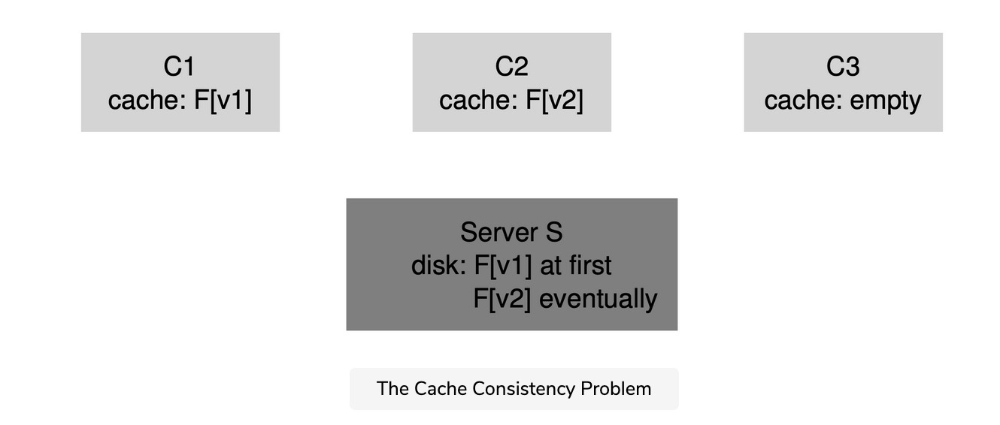

Distributed file systems are good for a number of reasons, but sending all read and write requests across the network can lead to a big performance problem: the network generally isn't that fast, especially as compared to local memory or disk.


The answer, as you might guess from reading the big bold words in the title of the lesson, is client-side caching. The NFS client-side file system caches file data (and metadata) that it has read from the server in client memory. Thus, while the first access is expensive (i.e., it requires network communication), subsequent accesses are serviced quite quickly out of client memory.

The cache also serves as a temporary buffer for writes. When a client application first writes to a file, the client buffers the data in client memory (in the same cache as the data it read from the file server) before writing the data out to the server. Such write buffering is useful because it decouples application write() latency from actual write performance, i.e., the application’s call to write() succeeds immediately (and just puts the data in the client-side file system’s cache). Only later does the data get written out to the file server.


Thus, NFS clients cache data, and performance is usually great and we are done, right? Unfortunately, not quite. Adding caching into any sort of system with multiple client caches introduces a big and interesting challenge which we will refer to as the cache consistency problem.


## The Cache Consistency Problem

The cache consistency problem is best illustrated with two clients and a single server. Imagine client C1 reads a file F, and keeps a copy of the file in its local cache. Now imagine a different client, C2, overwrites the file F, thus changing its contents; let’s call the new version of the file F (version 2), or F[v2] and the old version F[v1] so we can keep the two distinct (but of course the file has the same name, just different contents). Finally, there is a third client, C3, which has not yet accessed the file F.
svg viewer





## Update visibility


You can probably see the problem that is upcoming (from the figure above). In fact, there are two subproblems. The first subproblem is that the client C2 may buffer its writes in its cache for a time before propagating them to the server; in this case, while F[v2] sits in C2’s memory, any access of F from another client (say C3) will fetch the old version of the file (F[v1]). Thus, by buffering writes at the client, other clients may get stale versions of the file, which may be undesirable; indeed, imagine the case where you log into machine C2, update F, and then log into C3 and try to read the file, only to get the old copy! Certainly, this could be frustrating. Thus, let us call this aspect of the cache consistency problem update visibility; when do updates from one client become visible at other clients?


## Stale cache

The second subproblem of cache consistency is a stale cache; in this case, C2 has finally flushed its writes to the file server, and thus the server has the latest version (F[v2]). However, C1 still has F[v1] in its cache; if a program running on C1 reads file F, it will get a stale version (F[v1]) and not the most recent copy (F[v2]), which is (often) undesirable.


## Flush-on-close

NFSv2 implementations solve these cache consistency problems in two ways. First, to address update visibility, clients implement what is sometimes called flush-on-close (a.k.a., close-to-open) consistency semantics. Specifically, when a file is written to and subsequently closed by a client application, the client flushes all updates (i.e., dirty pages in the cache) to the server. With flush-on-close consistency, NFS ensures that a subsequent open from another node will see the latest file version.

Second, to address the stale-cache problem, NFSv2 clients first check to see whether a file has changed before using its cached contents. Specifically, before using a cached block, the client-side file system will issue a GETATTR request to the server to fetch the file’s attributes. The attributes, importantly, include information as to when the file was last modified on the server. If the time-of-modification is more recent than the time that the file was fetched into the client cache, the client invalidates the file, thus removing it from the client cache and ensuring that subsequent reads will go to the server and retrieve the latest version of the file. If, on the other hand, the client sees that it has the latest version of the file, it will go ahead and use the cached contents, thus increasing performance.


## Attribute cache

When the original team at Sun implemented this solution to the stale-cache problem, they realized a new problem; suddenly, the NFS server was flooded with GETATTR requests. A good engineering principle to follow is to design for the common case, and to make it work well. Here, although the common case was that a file was accessed only from a single client (perhaps repeatedly), the client always had to send GETATTR requests to the server to make sure no one else had changed the file. A client thus bombards the server, constantly asking “has anyone changed this file?” when most of the time no one had.

To remedy this situation (somewhat), an attribute cache was added to each client. A client would still validate a file before accessing it, but most often would just look in the attribute cache to fetch the attributes. The attributes for a particular file were placed in the cache when the file was first accessed, and then would timeout after a certain amount of time (say 3 seconds). Thus, during those three seconds, all file accesses would determine that it was OK to use the cached file and thus do so with no network communication with the server.


## Assessing NFS cache consistency


A few final words about NFS cache consistency. The flush-on-close behavior was added to “make sense”, but introduced a certain performance problem. Specifically, if a temporary or short-lived file was created on a client and then soon deleted, it would still be forced to the server. A more ideal implementation might keep such short-lived files in memory until they are deleted and thus remove the server interaction entirely, perhaps increasing performance.

More importantly, the addition of an attribute cache into NFS made it very hard to understand or reason about exactly what version of a file one was getting. Sometimes you would get the latest version; sometimes you would get an old version simply because your attribute cache hadn’t yet timed out and thus the client was happy to give you what was in client memory. Although this was fine most of the time, it would (and still does!) occasionally lead to odd behavior.

And thus we have described the oddity that is NFS client caching. It serves as an interesting example where details of an implementation serve to define user-observable semantics, instead of the other way around.


## 
A few final words about NFS cache consistency. The flush-on-close behavior was added to “make sense”, but introduced a certain performance problem. Specifically, if a temporary or short-lived file was created on a client and then soon deleted, it would still be forced to the server. A more ideal implementation might keep such short-lived files in memory until they are deleted and thus remove the server interaction entirely, perhaps increasing performance.

More importantly, the addition of an attribute cache into NFS made it very hard to understand or reason about exactly what version of a file one was getting. Sometimes you would get the latest version; sometimes you would get an old version simply because your attribute cache hadn’t yet timed out and thus the client was happy to give you what was in client memory. Although this was fine most of the time, it would (and still does!) occasionally lead to odd behavior.

And thus we have described the oddity that is NFS client caching. It serves as an interesting example where details of an implementation serve to define user-observable semantics, instead of the other way around.


# Implications on Server-Side Write Buffering

Our focus so far has been on client caching, and that is where most of the interesting issues arise. However, NFS servers tend to be well-equipped machines with a lot of memory too, and thus they have caching concerns as well. When data (and metadata) is read from disk, NFS servers will keep it in memory, and subsequent reads of said data (and metadata) will not go to disk, a potential (small) boost in performance.

More intriguing is the case of write buffering. NFS servers absolutely may not return success on a WRITE protocol request until the write has been forced to stable storage (e.g., to disk or some other persistent device). While they can place a copy of the data in server memory, returning success to the client on a WRITE protocol request could result in incorrect behavior; can you figure out why?


## Example


The answer lies in our assumptions about how clients handle server failure. Imagine the following sequence of writes as issued by a client:

``` shell
write(fd, a_buffer, size); // fill 1st block with a’s
write(fd, b_buffer, size); // fill 2nd block with b’s
write(fd, c_buffer, size); // fill 3rd block with c’s

```

These writes overwrite the three blocks of a file with a block of a’s, then b’s, and then c’s. Thus, if the file initially looked like this:

``` shell
xxxxxxxxxxxxxxxxxxxxxxxxxxxxxxxxxxxxxxxxxxxx
yyyyyyyyyyyyyyyyyyyyyyyyyyyyyyyyyyyyyyyyyyyy
zzzzzzzzzzzzzzzzzzzzzzzzzzzzzzzzzzzzzzzzzzzz
```

We might expect the final result after these writes to be like this, with the x’s, y’s, and z’s would be overwritten with a’s, b’s, and c’s, respectively.

``` shell
aaaaaaaaaaaaaaaaaaaaaaaaaaaaaaaaaaaaaaaaaaaa
bbbbbbbbbbbbbbbbbbbbbbbbbbbbbbbbbbbbbbbbbbbb
cccccccccccccccccccccccccccccccccccccccccccc
```

 
Now let’s assume for the sake of the example that these three client writes were issued to the server as three distinct WRITE protocol messages. Assume the first WRITE message is received by the server and issued to the disk, and the client informed of its success. Now assume the second write is just buffered in memory, and the server also reports it success to the client before forcing it to disk; unfortunately, the server crashes before writing it to disk. The server quickly restarts and receives the third write request, which also succeeds.

Thus, to the client, all the requests succeeded, but we are surprised that the file contents look like this:

``` shell
aaaaaaaaaaaaaaaaaaaaaaaaaaaaaaaaaaaaaaaaaaaa
yyyyyyyyyyyyyyyyyyyyyyyyyyyyyyyyyyyyyyyyyyyy <--- oops
cccccccccccccccccccccccccccccccccccccccccccc
```

Yikes! Because the server told the client that the second write was successful before committing it to disk, an old chunk is left in the file, which, depending on the application, might be catastrophic.

To avoid this problem, NFS servers must commit each write to stable (persistent) storage before informing the client of success; doing so enables the client to detect server failure during a write, and thus retry until it finally succeeds. Doing so ensures we will never end up with file contents intermingled as in the above example.

The problem that this requirement gives rise to in NFS server implementation is that write performance, without great care, can be the major performance bottleneck. Indeed, some companies (e.g., Network Appliance) came into existence with the simple objective of building an NFS server that can perform writes quickly. One trick they use is to first put writes in a battery-backed memory, thus enabling to quickly reply to WRITE requests without fear of losing the data and without the cost of having to write to disk right away. The second trick is to use a file system design specifically designed to write to disk quickly when one finally needs to do so.


``` shell

As with many pioneering technologies, bringing NFS into the world also required other fundamental innovations to enable its success. Probably the most lasting is the Virtual File System (VFS) / Virtual Node (vnode) interface, introduced by Sun to allow different file systems to be readily plugged into the operating system.

The VFS layer includes operations that are done to an entire file system, such as mounting and unmounting, getting file-system wide statistics, and forcing all dirty (not yet written) writes to disk. The vnode layer consists of all operations one can perform on a file, such as open, close, reads, writes, and so forth.

To build a new file system, one simply has to define these “methods”. The framework then handles the rest, connecting system calls to the particular file system implementation, performing generic functions common to all file systems (e.g., caching) in a centralized manner, and thus providing a way for multiple file system implementations to operate simultaneously within the same system.

Although some of the details have changed, many modern systems have some form of a VFS/vnode layer, including Linux, BSD variants, macOS, and even Windows (in the form of the Installable File System). Even if NFS becomes less relevant to the world, some of the necessary foundations beneath it will live on.

```


## summary

We have seen the introduction of the NFS distributed file system. NFS is centered around the idea of simple and fast recovery in the face of server failure and achieves this end through careful protocol design. Idempotency of operations is essential; because a client can safely replay a failed operation, it is OK to do so whether or not the server has executed the request.


We also have seen how the introduction of caching into a multiple-client, single-server system can complicate things. In particular, the system must resolve the cache consistency problem in order to behave reasonably. However, NFS does so in a slight ad hoc fashion which can occasionally result in observably weird behavior. Finally, we saw how server caching can be tricky: writes to the server must be forced to stable storage before returning success (otherwise data can be lost).

We haven’t talked about other issues that are certainly relevant, notably security. Security in early NFS implementations was remarkably lax; it was rather easy for any user on a client to masquerade as other users and thus gain access to virtually any file. Subsequent integration with more serious authentication services (e.g., Kerberos) have addressed these obvious deficiencies.


    ASIDE: KEY NFS TERMS

        The key to realizing the main goal of fast and simple crash recovery in NFS is in the design of a stateless protocol. After a crash, the server can quickly restart and begin serving requests again; clients just retry requests until they succeed.
        Making requests idempotent is a central aspect of the NFS protocol. An operation is idempotent when the effect of performing it multiple times is equivalent to performing it once. In NFS, idempotency enables client retry without worry and unifies client lost-message retransmission and how the client handles server crashes.
        Performance concerns dictate the need for client-side caching and write buffering, but introduces a cache consistency problem.
        NFS implementations provide an engineering solution to cache consistency through multiple means: a flush-on-close (close-to-open) approach ensures that when a file is closed, its contents are forced to the server, enabling other clients to observe the updates to it. An attribute cache reduces the frequency of checking with the server whether a file has changed (via GETATTR requests).
        NFS servers must commit writes to persistent media before returning success; otherwise, data loss can arise.
        To support NFS integration into the operating system, Sun introduced the VFS/Vnode interface, enabling multiple file system implementations to coexist in the same operating system.

