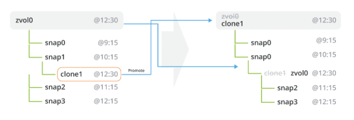

Before we can get into the practical administration of ZFS datasets, we need to understand exactly how ZFS is storing our data. SO, this post will be theoretical and cover a couple of concepts that you will want to understand. Namely the Merkle tree and copy-on-write. I'll try and  keep it at a higher level that is easier to understand, without getting into C code system calls and memory allocations.

## Merkle Trees

Merkle trees are nothing more than cryptographic hash trees, invented by Ralph Merkle. In order to understand a Merkle tree, we will start from the bottom, and work our way up the tree. Suppose you have 4 data blocks , block 0, block 1, block 2 and block 3. Each block is cryptographically hashed , and their hash is stored in a node, or "hash block". Each data block has a one-to-one relationship with their hash block. Let's assume the SHA-256 cryptographic hashing algorithm is the hash used. Suppose further that our four blocks hash to the following:

- Block 0- 888b19a43b151683c87895f6211d9f8640f97bdc8ef32f03dbe057c8f5e56d32 (hash block 0-0)
- Block 1- 4fac6dbe26e823ed6edf999c63fab3507119cf3cbfb56036511aa62e258c35b4 (hash block 0-1)
- Block 2- 446e21f212ab200933c4c9a0802e1ff0c410bbd75fca10168746fc49883096db (hash block 1-0)
- Block 3- 0591b59c1bdd9acd2847a202ddd02c3f14f9b5a049a5707c3279c1e967745ed4 (hash block 1-1)

The reason we cryptographically hash each block, is to ensure data integrity. If the block intentionally changes, then its SHA-256 hash should also change. If the block was corrupted, then the hash would not change. Thus, we can cryptographically hash the block with the SHA-256 algorithm, and check to see if it matches its parent hash block. If it does, then we can be certain with a high degree of probability that the block was not corrupted. However, if the hash does not match, then under the same premise, the block is likely corrupted.

Hash trees are typically binary trees (one node has at most 2 children), although there is no requirement to make them so. Suppose in our example, our hash tree is a binary tree. In this case, hash blocks 0-0 and 0-1 would have a single parent, hash block 0. And hash blocks 1-0 and 1-1 would have a single parent, hash block 1 (as shown below). Hash block 0 is a SHA-256 hash of concatenating hash block 0-0 and hash block 0-1 together. Similarly for hash block 1. Thus, we would have the following output:

Hash block 0- 8a127ef29e3eb8079aca9aa5fc0649e60edcd0a609dd0285d1f8b7ad9e49c74d
Hash block 1- 69f1a2768dd44d11700ef08c1e4ece72c3b56382f678e6f20a1fe0f8783b12cf

We continue in a like manner, climbing the Merkle tree until we get to the super hash block, super node or uber block. This is the parent node for the entire tree, and it is nothing more than a SHA-256 hash of its concatenated children. Thus, for our uber block, we would have the following output by concatenating hash blocks 0 and 1 together:

Uber block- 6b6fb7c2a8b73d24989e0f14ee9cf2706b4f72a24f240f4076f234fa361db084

This uber block is responsible for verifying the integrity of the entire Merkle tree. If a data block changes, all the parent hash blocks should change as well, including the uber block. If at any point, a hash does not match its corresponding children, we have inconsistencies in the tree or data corruption.

ZFS uses a Merkle tree to verify the integrity of the entire filesystem and all of the data stored in it. When you scrub your storage pool, ZFS is verifying every SHA-256 hash in the Merkle tree to make sure there is no corrupted data. If there is redundancy in the storage pool, and a corrupted data block is found, ZFS will look elsewhere in the pool for a good data block at the same location by using these hashes. If one is found, it will use that block to fix the corrupted one, then reverify the SHA-256 hash in the Merkle tree.

## Copy-on-write (COW)

Copy-on-write(COW) is a data storage technique in which you make a copy of the data block that is going to be modified, rather than modify the data block directly. You then update your pointers to look at the new block location, rather than the old. You  also free up the old block, so it can be available to the application. Thus, you don't use any more disk space than if you were to modify the original block. However , you do severly fragment the underlying data. But, the COW model of data storage opens up new features for our data that were previously either impossible or very difficult to implement.

The biggest feature of COW is taking snapshots of your data. Because we've made a copy of the block elsewhere on the filesystem, the old block still remains, even though it's been marked as free by the filesystem. With COW, the filesystem is working its way slowly to the end of the disk. It may take a long time before the old freed up blocks are rewritten to. If a snapshot has been taken, it's treated as a first class filesystem. If a block gets overwritten after it has been snapshotted, it gets copied to the snapshot filesystem. This is possible , because the snapshot is a copy of the hash tree at that exact moment. As such, snapshots are super cheap, and unless the snapshotted blocks are overwritten, they take up barely any space.

In the following image, when a data block is updated, the hash tree must also be updated. All hashes starting with the child block, and all its parent nodes must be updated with the new hash. The yellow blocks are a copy of the data, elsewhere on the system, and the parent hash nodes  are updated to point to the new block locations.

As mentioned, COW heavily fragments the disk. This can have massive performance impacts. So, some work needs to be taken to allocate blocks in advance to minimize fragmentation. There are two basic approaches: using a b-tree to pre-allocates extents, or using a slab approach, marking slabs of disk for the copy. ZFS uses the slab approach, where Btrfs uses the b-tree approach.

Normally, filesystems write data in 4 KB blocks. ZFS writes data in 128 KB blocks. This minimizes the fragmentation by an order of 32. Second, the slab allocater will allocate a slab, then chop up the slab into 128 KB blocks. Thirdly, ZFS delays syncing data to disk every 5 seconds. All data remaining is flushed after 30 seconds. That makes a lot of data flushed to disk at once, in the slab. As a result, this highly increases the probability that similar data will be in the same slab. So, in practice, even though COW is fragmenting the filesystem, there are a few things we can do to greatly minimize that fragmentation.

Not only does ZFS use the COW model, so does Btrfs, NILFS, WAFL and the new Microsoft filesystem ReFS. Many virtualization technologies use COW for storing VM images, such as Qemu. COW filesystems are the future of data storage. We'll discuss snapshots in much more intimate detail at a later post, and how the COW model plays into that.

# Other

## Copy-On-Write

On predominant number of file systems , the data is irreversibly lost during the overwrite operation. On ZFS, however,
the data changes are performed on the copy of the data instead of the original data blocks. In other words, the changes are stored on a different location on a disk and then the metadata is updated in that plae on the disk.

This mechanism guarantees that the old data is safely preserved in case of power loss or system crash that in other cases would result in loss of data. On other file systems, the data would be left in an inconsistent state and the Linux and Unix fsck command would have to be run to ensure that data is not corrupted. Moreover, this mechanism used for storing data is used by snapshots that are described in the next section.

## Snapshots

A snapshot is an unchangeable copy of a file system made during a particular point in time. You are able to create snapshots of entire datasets or volumes.

Complete snapshots can be restored thus allowing to retrieve the snapshot’s directories and files. The snapshot contains information about the original version of the file system to be retained. Snapshots do not require additional disk space within the pool. Once the data rendered in a snapshot is modified, the snapshot will take the disk space since it will now be pointing to the old data. This prohibits releasing the data back to the Zpool.

It is also possible to return to a particular point in time when the snapshot was made by performing the rollback operation. In this case, all modifications that were made after the snapshot was taken will be irreversibly lost. Snapshots are presented in the figure below.

## Clones 

To create a writable version of a snapshot, a clone has to be made. In the beginning , it does not require additional disk space. Once new blocks are allocated and new data is being written to the clone, its size grows. Overwriting the blocks in the cloned volume or file system results in decrementing the reference count on the previous block. Since the clone is dependable on the snapshot that was used to create the clone, you are unable to delete the original snapshot. The following figure presents the concept of a clone.

## Rollback and Promote

As indicates in one of the sections above, a rollback command has to be used if there is a need to go back to a previous version of a dataset or a volume. In such case, all changes made later than a given snapshot was made will be lost. The file or a volume will be restored to the state at which a particular snapshot was taken. Note that the rollback command cannot revert changes from other snapshots than the most recent one. If for some reason, you would like to retrieve changes from an earlier snapshot than the most recent one, then all intermediate snapshots will be automatically destroyed. The process of a snapshot rollback is presented in the image below:

ZFS also allows you to replace an existing volume with its clone if you were using clones, as described in the previous section, and now want to use the clone instead of an original volume. This can be done by using the promote command. The process of a snapshot promote is presented in the image below.

The promote function, for instance, will be required to execute when a volume clone was created and assigned to production as a result of instant recovery from a snapshot of a production volume which has been destroyed. Then, to clean up, we need to remove the original destroyed volume but first, it must be replaced with the (working) clone.

## Cloning notes

